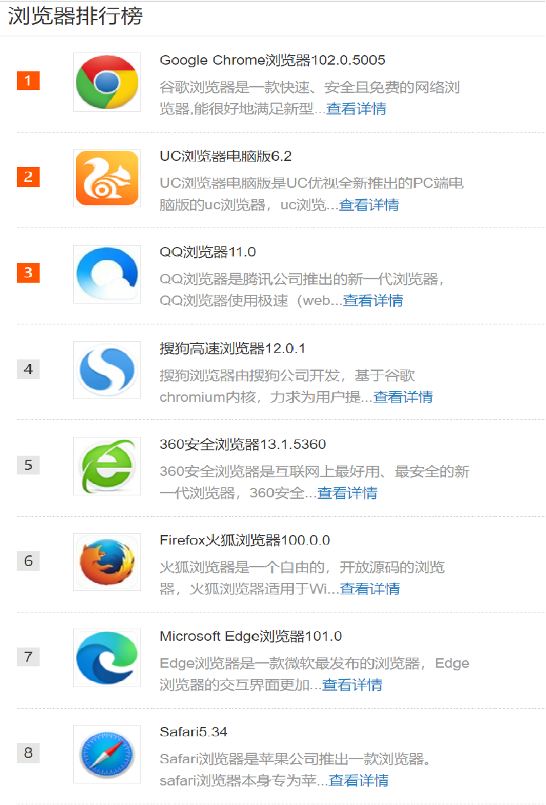
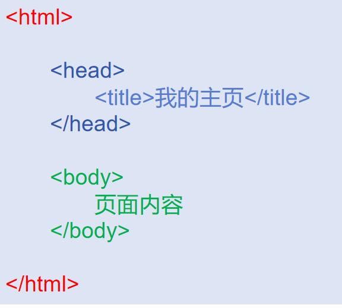
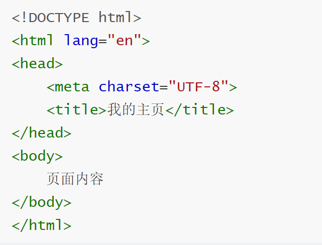
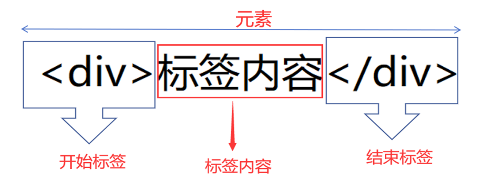
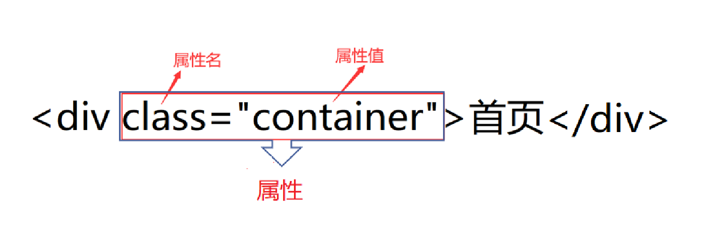
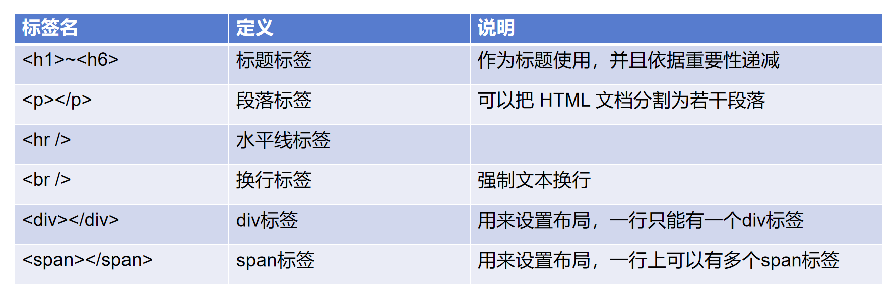
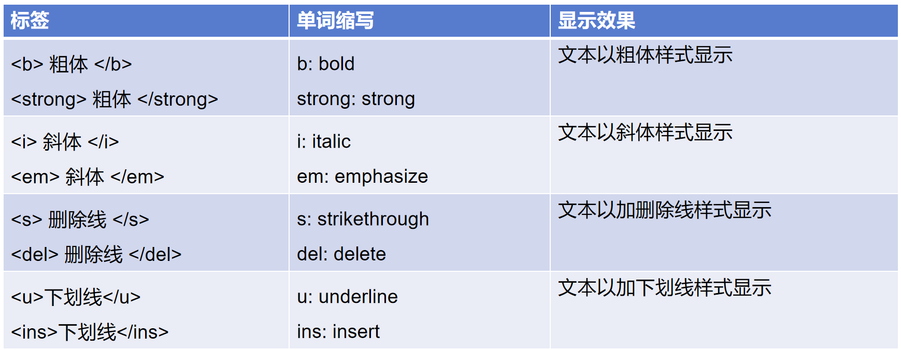
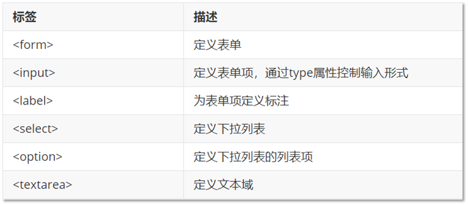
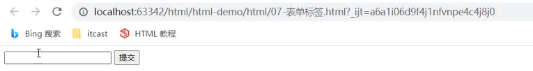
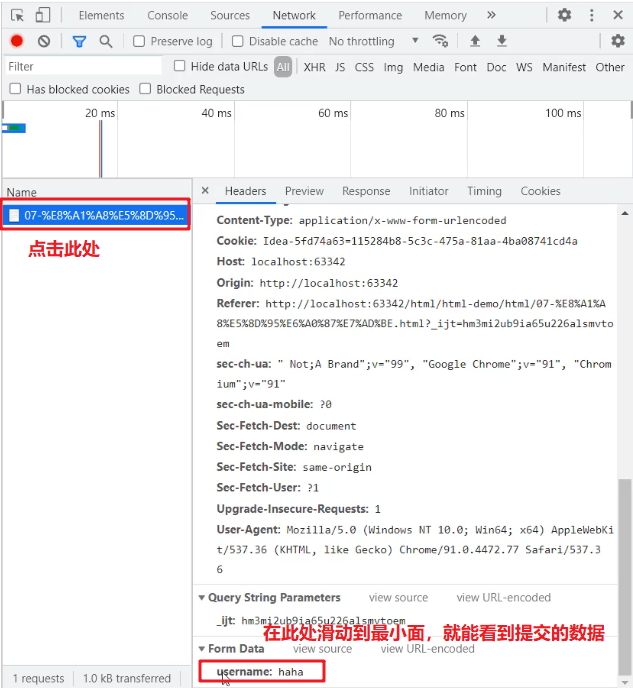

## 1.HTML

- web开发是创建Web页面或App等前端界面呈现给用户的过程。
- web开发开发是从网页制作演变而来，早期网站主要内容都是静态，用户使用网站的行为也以浏览为主。
- 随着互联网技术的发展，各种终端设备应用程序与用户沟通交互的界面，都是由Web开发完成。现今，前端开发领域就更加广泛，包含后端(nodejs)，小程序开发，Android和ios的App开发，游戏，大数据，桌面应用等。

## 2. 了解网页和浏览器

### 2.1 什么是网页

- 网页是网站的基本单位，也叫Web页面，是承载各种网站应用的平台。
- 网页由主要由文字，图片和链接构成，除此之外，网页的元素还包括表格、动画、音频、视频等等。

### 2.2 浏览器

**浏览器（browser application）是用来访问和浏览万维网页面的客户端软件，是显示、运行网页的平台。**

**目前国内浏览器使用排行**




### 2.3 浏览器的组成部分

浏览器有以下主要部分组成：

1. 用户界面
   包括浏览器中可见的地址输入框，浏览器前进返回按钮，打开书签，打开历史记录等用户可操作性的功能选项。
2. 浏览器引擎(渲染引擎)
   渲染引擎负责读取网页内容，整理讯息，计算网页的显示方式并显示页面。
3. JS 解释器
   用来解释和执行 JavaScript 代码，例如 V8 引擎，执行 javascript语言来实现网页的动态效果。

## 3. Web 标准

Web标准，使得Web开发更加容易。Web标准由万维网联盟（W3C）制定。

### 3.1 为什么要Web标准？

- 对于浏览器开发商和 Web 程序开发人员在开发新的应用程序时遵守指定的标准更有利于 Web 更好地发展。
- 开发人员按照 Web 标准制作网页，这样对于开发者来说就更加简单了，因为他们可以很容易了解彼此的编码。
- 将确保所有浏览器正确显示您的网站而无需费时重写。

### 3.2 Web 标准构成

- Web标准不是某一个标准，而是由W3C和其他标准化组织制定的一系列标准的集合。

- w3c 万维网联盟组织，制定web标准的机构。

- 主要包括结构（Structure）、表现（Presentation）和行为（Behavior）三个方面。

  **web主要包括结构、表现、行为三方面：**

| 含义   | 内容                                |
| ---- | --------------------------------- |
| 结构   | 用于对网页元素的进行整理和分类，指的就是html；         |
| 表现   | 用于设置网页元素的版式、颜色、大小等外观样式，指的就是css    |
| 行为   | 指网页模型的定义以及交互的编写，主要指的就是javascript； |

简单理解，结构写到html文件中，表现写到css文件中，行为写到Javascript文件中。


## 4. VSCode的基本使用

 Visual Studio Code (简称 VS Code / VSC) 是由微软开发的一款开源源代码编辑器，免费开源的现代化轻量级代码编辑器，支持几乎所有主流的开发语言的语法高亮、智能代码补全、自定义热键、括号匹配、代码片段、代码对比 Diff、GIT 等特性，支持插件扩展，并针对网页开发和云端应用开发做了优化。软件跨平台支持 Win、Mac 以及 Linux。

### 4.1 VSCode安装

VSCode是免费的软件，下载地址链接:[官网下载](https://code.visualstudio.com/) 

### 4.2 扩展程序（安装各种插件）

1.汉化

把中文插件Chinese(simplified) 安装一遍，然后重启软件即可。

2.在浏览器中打开网页

 安装插件：Open HTML in Default Browser，用默认浏览器打开 HTML 文件 。

## 5. HTML简介

HTML 的全称为 **超文本标记语言（Hyper Text Markup Language）**

所谓超文本，因为它可以加入图片、声音、动画、多媒体等内容，不仅如此，它还可以从一个文件跳转到另一个文件，与各地主机的文件连接。

- HTML 指的是超文本标记语言 (**H**yper **T**ext **M**arkup **L**anguage)
- HTML 不是一种编程语言，而是一种标记语言 (markup language),标记语言是一套标记标签 (markup tag)

### 5.1 HTML文档结构

要创建一个HTML文档，最简单的方法是创建一个文本文件，然后将其扩展名保存成.html。

组成文档结构的元素只有4个，这也是任何HTML文档都必须有的元素。

       


```
<head>`元素提供了关于这篇文档的信息。
<title>`定义页面标题。
<body>`定义文档的主体，用户所看到的内容。
```


### 5.2 完整的文档结构



**文档结构说明：**

​	

```
- `<!DOCTYPE>`文档类型和版本的声明（HTML5版本号可以省略）。

- lang：HTML 的 lang 属性可用于网页或部分网页的语言。这对搜索引擎和浏览器是有帮助的。

  根据 W3C 推荐标准，您应该通过 <html> 标签中的 lang 属性对每张页面中的主要语言进行声明。

- `charset="UTF-8"`字符集

  > 
```


注意:UTF-8则包含全世界所有国家需要用到的字符，是目前最常用的字符集编码方式。

记住一点，以后我们统统使用UTF-8 字符集, 这样就避免出现字符集不统一而引起乱码的情况了。

### 5.3 HTML元素

元素（Element）：由开始标签、闭合标签以及标签之间的内容组成。



### 5.4 HTML 属性

元素可以用属性进行配置。属性由属性名和属性值组成，例如：



- 属性总是写在开始标签中。
- 属性名和元素名之间要有一个空格。
- 属性名后面要跟一个等号（=）。
- 属性值使用双引号括起来。
- 一个元素可以有多个属性，这些属性之间以空格分隔。

## 6.HTML常用标签

首先 HTML和CSS是两种完全不同的语言，我们学的是结构，就只写HTML标签，认识标签就可以了。 不会再给结构标签指定样式了。

HTML标签有很多，这里我们学习最为常用的，后面有些较少用的，我们可以查下手册就可以了。 

### 6.1 排版标签

排版标签主要和css搭配使用，显示网页结构的标签，是网页布局最常用的标签。

#### 6.1.1 标题标签

单词缩写： head 头部

为了使网页更具有语义化，我们经常会在页面中用到标题标签，HTML提供了6个等级的标题，

```
 <h1>一级标题</h1>
 <h2>二级标题</h2>
 <h3>三级标题</h3>
 <h4>四级标题</h4>
 <h5>五级标题</h5>
 <h6>六级标题</h6>
```

> 注意： h1 标签表示页面中最重要标题信息，要求只能有一个h1标签。

#### 6.1.2 段落标签

单词缩写： paragraph 段落

标签表示文本的段落，段落通常在文档中表示为文本块，会自动在其前后创建一些空白。

```
<p>  文本内容  </p>
```

#### 6.1.3 换行标签

- 单词缩写： break 打断 ,换行
- 在HTML中，用来设置文本强制换行显示。

```
<br/>
```

#### 6.1.4 div标签

- 单词缩写： division 分开

- div标签本身没有含义，在html中布局使用最多标签为div，用来为HTML文档内大块的内容提供结构。

  ```html
  <div> 这是块内容 </div> 
  <div> 这是块内容 </div>
  <div> 这是块内容 </div>
  ```

> 注意点: <div></div>是块级元素，独占一行

#### 6.1.5  span标签

- 单词缩写：span 跨度，跨距 。

- span本身没有什么含义，可用作文本的容器，包含着文本内容，还可以通过对span标签对象设置不同样式实现我们要的美化效果。

  ```html
  <span> 文本内容 </span> 
  <span> 文本内容 </span>
  <span> 文本内容 </span>
  ```

> 注意点: span是行内元素

#### 6.1.6 排版标签总结



### 6.2 文本格式化标签(熟记)

在网页中，有时需要为文字设置粗体、斜体或下划线效果，这时就需要用到HTML中的文本格式化标签，使文字以特殊的方式显示。



> 注意点: 
> strong、em 、del 、ins 标签(推荐使用)有语义，起到加重语气的效果;
> b、 i 、s、 u标签是没有的语气

### 6.3 图像标签img (重点)

单词缩写： image 图像

HTML网页中任何元素的实现都要依靠HTML标签，要想在网页中显示图像就需要使用图像标签，其基本语法格式如下：

```

```

属性：

- src：该属性指定图片文件所在的位置，可以是相对路径，也可以是绝对路径。

- alt：该属性指定一段文本，用来作为该图片的提示信息。

- height：指定图片的高度，属性值可以是百分比，也可以是像素值。

- width：指定图片的宽度，属性值可以是百分比，也可以是像素值。

- 注意引入路径问题：

  ```html
  1. 图像文件和HTML文件位于同一文件夹：只需输入图像文件的名称即可，如。  
  2. 图像文件位于HTML文件的下一级文件夹：输入文件夹名和文件名，之间用“/”隔开，如。  
  3. 图像文件位于HTML文件的上一级文件夹：在文件名之前加入“../” ，如果是上两级，则需要使用 “../ ../”，以此类推，如。 
  ```

### 6.4 链接标签(重点)

单词缩写： anchor   锚 

在HTML中创建超链接非常简单，只需用标签环绕需要被链接的对象即可，其基本语法格式如下：

```
<a href="跳转目标" target="目标窗口的弹出方式">文本或图像</a>
```

属性: 

- href( Hypertext  Reference的缩写)：意思是超文本引用，用于指定链接目标的url地址，当为标签应用href属性时，它就具有了超链接的功能。
- target：用于指定链接页面的打开方式，其取值有`_self`和`_blank`两种，其中`_self`为默认值，`_blank`为在新窗口中打开方式。

> 注意点：
>
> 1.外部链接需要添加 http:// [www.baidu.com](http://www.baidu.com/)
>
> 2.内部链接直接链接内部页面名称即可 比如 `< a href=”index.html”>` 首页 
>
> 3.如果当时没有确定链接目标时，通常将链接标签的href属性值定义为“#”(即href=”#”)，表示该链接暂时为一个空链接。
>
> 4.不仅可以创建文本超链接，在网页中各种网页元素，如图像、表格、音频、视频等都可以添加超链接。

### 6.5 锚点定位

通过创建锚点链接，用户能够快速定位到目标内容。

创建锚点链接分为两步：

1. 使用<a href="#id名">链接文本</a>创建链接文本（被点击的元素）

   ```html
   <a href="#con">   
   ```

2. 使用相应的id名标注跳转目标的位置。 (找目标位置元素)

   ```html
   <p id="con">关于我们</p> 
   ```

### 6.6 网页的icon图标

 `<head>` 元素包含了所有的头部标签元素,使用link标签添加icon图标，meta标签添加网站相关信息。

- 添加icon图标

  ```html
  <link rel="shortcut icon" href="http://example.com/favicon.ico" type="image/x-icon"> 
  ```

### 6.7 使用特殊字符

实体是浏览器用来替代特殊字符的一种编码，下表中列出了网页中常用的一些特殊字符。

**最常用的字符实体**

| 显示结果  | 描述        | 实体名称       | 实体编号      |
| ----- | --------- | ---------- | --------- |
| ` `   | 空格(不换行空格) | `&nbsp;  ` | `&#160;`  |
| `   ` | 空格（全角）    | `&emsp;`   | `&#8195;` |
| `<`   | 小于号       | `&lt;    ` | `&#60; `  |
| `>`   | 大于号       | `&gt;    ` | `&#62; `  |
| `©`   | 版权        | `&copy;  ` | `&#169;`  |

### 6.8 注释标签

在HTML中还有一种特殊的标签——注释标签。如果需要在HTML文档中添加一些便于阅读和理解但又不需要显示在页面中的注释文字，就需要使用注释标签。使用ctrl + /       或者 ctrl +shift + / 快捷键就可

```css
<!-- 注释语句 -->  
```

> 注意：注释内容不会显示在浏览器窗口中，但是作为HTML文档内容的一部分，也会被下载到用户的计算机上，查看源代码时就可以看到。

## 7. HTML标签分类

1.双标签

由开始标签和结束标签组成的一对标签，它可以嵌套和承载内容。

```html
<div>我是文字 </div>
```

2.单标签

指没有内容的标签，在开始标签中自动闭合。

```html
<br />
```

## 8. HTML标签关系

标签的相互关系就分为两种：

1.嵌套关系

```html
<head>  
    <title> </title>  
</head>
```

2.并列关系

```html
<head></head>
<body></body>
```

提示： 如果两个标签之间的关系是嵌套关系，子元素最好缩进一个tab键的身位。如果是并列关系，最好上下对齐。

## 9.HTML标签的语义化

所谓标签语义化，就是指标签的含义，合适的地方给一个最为合理的标签。

1. 方便代码的阅读和维护
2. 同时让浏览器可以很好地解析，从而更好分析其中的内容 
3. 使用语义化标签会具有更好地搜索引擎优化。


## 10.列表

### 10.1 无序列表

```
`<ul>`：定义无序列表，并且只能包含`<li>`子元素。
`<li>`：定义列表项，可以包含与`<div>`完全类似的内容，所以可以包含较多类型的子元素。
```

单词缩写:

u.l是unordered lists的缩写 (无序列表) 

 l.i是list item的缩写 （列表项目）

```html
<ul>
    <li>无序列表项</li>
    <li>无序列表项</li>
    <li>无序列表项</li>
</ul> 
```

> 注意：
>
> ```
> <ul></ul>`中只能嵌套`<li></li>`，直接在`<ul></ul>`标签中输入其他标签或者文字的做法是不被允许的。
>
> <li>`与`</li>`之间相当于一个容器，可以容纳所有元素。
> ```
>
> 

### 10.2 有序列表

有序列表即为有排列顺序的列表，其各个列表项按照一定的顺序排列定义，有序列表的基本语法格式如下：

单词缩写:

o.l是ordered lists的缩写（有序列表） 

 l.i是list item的缩写 （列表项目）

```html
<ol>
  <li>列表项1</li>
  <li>列表项2</li>
  <li>列表项3</li>
  ......
</ol>
```

- ```
  - 所有特性基本与ul 一致。  
  - 但是实际工作中， 较少用 ol ，因此我们用一句话来总结下 ol：
  - 有序列表中默认的type类型是数字，而且是从1开始的。它有两个属性：type、start。  
  - type：有五个属性值：1、a、A、i、I(罗马数字)，表示列表前缀的格式； 
  - start：属性值位数字， 表示从type类型的第几个数字开始，比如当你选的type=“a”,start=“3”。
  ```

  ​

### 10.3 自定义列表


```
`<dl>`：定义列表
`<dt>`：定义 标签定义了定义列表中的项目(术语)
`<dd>`：定义描述
```

单词缩写:
d.l是definition lists的英文缩写 (自定义列表)
d.t是definition term的缩写 (自定义列表项)
d.d是definition description的缩写（自定义列表描述）

```html
<dl>
    <dt>支付方式</dt>
    <dd>货到付款</dd>
    <dd>在线支付</dd>
    <dd>分期付账</dd>
</dl>
```

### 10.4 列表总结

| 标签名         |  定义   | 说明                             |
| ----------- | :---: | :----------------------------- |
| <u.l></u.l> | 无序标签  | 里面只能包含li    没有顺序，我们以后布局中最常用的列表 |
| <o.l></o.l> | 有序标签  | 里面只能包含li    有顺序， 使用情况较少        |
| <d.l></d.l> | 自定义列表 | 里面有2个兄弟， dt 和 dd               |

### 10.5  图片、音频、视频标签


- ```
  - img：定义图片
    - src：规定显示图像的 URL（统一资源定位符）
    - height：定义图像的高度
    - width：定义图像的宽度
  - audio：定义音频。支持的音频格式：MP3、WAV、OGG 
    - src：规定音频的 URL
    - controls：显示播放控件
  - video：定义视频。支持的音频格式：MP4, WebM、OGG
    - src：规定视频的 URL
    - controls：显示播放控件
  ```

**尺寸单位：**

h.eight属性和w.idth属性有两种设置方式：

- 像素：单位是p.x
- 百分比。占父标签的百分比。例如宽度设置为 50%，意思就是占它的父标签宽度的一般（50%）

**资源路径：**

图片，音频，视频标签都有s.rc属性，而s.rc是用来指定对应的图片，音频，视频文件的路径。此处的图片，音频，视频就称为资源。资源路径有如下两种设置方式：

- 绝对路径：完整路径

  这里的绝对路径是网络中的绝对路径。 格式为： 协议://ip地址:端口号/资源名称。

  如：

  ```
  
  ```

  这里s.rc属性的值就是网络中的绝对路径。

- 相对路径：相对位置关系

  找页面和其他资源的相对路径。

  > ./    表示当前路径
  >
  > ../   表示上一级路径
  >
  > ../../   表示上两级路径

  如模块目录结构如下：

  

  在上面的标签中找不同的图片，路径写法不同

  ```html
  <!--在该页面找a.jpg，就需要先回到上一级目录，该级目录有img目录，进入该目录就可以找到 a.jpg图片-->
  
  <!--该页面和aa.jpg 是在同一级下，所以可以直接写 图片的名称，也可以写成  ./aa.jpg-->
  
  ```

使用这些标签的代码如下：

```html

<audio src="b.mp3" controls></audio>
<video src="c.mp4" controls width="500" height="300"></video>
```

在浏览器展示的效果如下：


### 10.6  表单标签

表单标签效果大家其实都不陌生，像登陆页面、注册页面等都是表单。


像这样的表单就是用来采集用户输入的数据，然后将数据发送到服务端，服务端会对数据库进行操作，比如注册就是将数据保存到数据库中，而登陆就是根据用户名和密码进行数据库的查询操作。

表单是很重要的标签，需要大家重点来学习。

#### 10.6.1  表单标签概述

> ```
> 表单：在网页中主要负责数据采集功能，使用<f.orm>标签定义表单
>
> 表单项(元素)：不同类型的 input 元素、下拉列表、文本域等
> ```
>
> 



`f.orm` 是表单标签，它在页面上没有任何展示的效果。需要借助于表单项标签来展示不同的效果。如下图就是不同的表单项标签展示出来的效果。


#### 10.6.2  f'orm标签属性

```
**action：规定当提交表单时向何处发送表单数据，该属性值就是URL**
```

```
以后会将数据提交到服务端，该属性需要书写服务端的URL。而今天我们可以书写 `#` ，表示提交到当前页面来看效果。
```

- ```
  **method ：规定用于发送表单数据的方式**

  method取值有如下两种：

  get：默认值。如果不设置method属性则默认就是该值

  - 请求参数会拼接在URL后边
  - url的长度有限制 4KB

  post：

  - 浏览器会将数据放到http请求消息体中
  - 请求参数无限制的

  ```

  ​

#### 10.6.3  代码演示

由于表单标签在页面上没有任何展示的效果，所以在演示的过程是会先使用 `i.nput` 这个表单项标签展示输入框效果。

代码如下：

```html
<!DOCTYPE html>
<html lang="en">
<head>
    <meta charset="UTF-8">
    <title>Title</title>
</head>
<body>
    <form>
        <input type="text">
        <input type="submit">
    </form>
</body>
</html>
```

浏览器展示效果如下：

 

```
从效果可以看到页面有一个输入框，用户可以在数据框中输入自己想输入的内容，点击提交按钮以后会将数据发送到服务端，当然现在肯定不能实现。现在我们可以将 `form` 标签的 `action` 属性值设置为 `#` ，将其将数据提交到当前页面。还需要注意一点，要想提交数据，`input` 输入框必须设置 `name` 属性。代码如下：

```


```html
<!DOCTYPE html>
<html lang="en">
<head>
    <meta charset="UTF-8">
    <title>Title</title>
</head>
<body>
    <form action="#">
        <input type="text" name="username">
        <input type="submit">
    </form>
</body>
</html>
```

浏览器展示效果如下：

 

在输入框输入 `h.ehe` ，然后点击 `提 交` 按钮，就能看到如下效果

 

```
我们可以看到在浏览器的地址栏的URL后拼接了我们提交的数据。`username` 就是输入框 `name` 属性值，而 `hehe` 就是我们在输入框输入的内容。

```


```
接下来我们来聊 `method` 属性，默认是 `method = 'get'`，所以该取值就会将数据拼接到URL的后面。那我们将 `method` 属性值设置为 `post`，浏览器的效果如下：

```

 

从上图可以看出数据并没有拼接到 URL 后，那怎么看提交的数据呢？我们可以使用浏览器的开发者工具来查看


按照如上步骤操作能看到如下页面


重新提交数据后，可以看到提交的数据，如下图



### 10.7  表单项标签

表单项标签有很多，不同的表单项标签有不同的展示效果。表单项标签可以分为以下三个：

- ```
  \<input>：表单项，通过type属性控制输入形式

  `input` 标签有个 `type` 属性。 `type` 属性的取值不同，展示的效果也不一样

  ```

  


- ```
  <select>：定义下拉列表，\<option> 定义列表项 

  如下图就是下拉列表的效果：

  ```

   

- ```
  <textarea>：文本域

  如下图就是文本域效果。它可以输入多行文本，而 `input` 数据框只能输入一行文本。

  ```

   

> ==注意：==
>
> - 以上标签项的内容要想提交，必须得定义 `name` 属性。
> - 每一个标签都有id属性，id属性值是唯一的标识。
> - 单选框、复选框、下拉列表需要使用 `value` 属性指定提交的值。

**代码演示：**

```html
<!DOCTYPE html>
<html lang="en">
<head>
    <meta charset="UTF-8">
    <title>Title</title>
</head>
<body>
    <form action="#" method="post">
        <input type="hidden" name="id" value="123">

        <label for="username">用户名：</label>
        <input type="text" name="username" id="username"><br>

        <label for="password">密码：</label>
        <input type="password" name="password" id="password"><br>

        性别：
        <input type="radio" name="gender" value="1" id="male"> <label for="male">男</label>
        <input type="radio" name="gender" value="2" id="female"> <label for="female">女</label>
        <br>

        爱好：
        <input type="checkbox" name="hobby" value="1"> 旅游
        <input type="checkbox" name="hobby" value="2"> 电影
        <input type="checkbox" name="hobby" value="3"> 游戏
        <br>

        头像：
        <input type="file"><br>

        城市:
        <select name="city">
            <option>北京</option>
            <option value="shanghai">上海</option>
            <option>广州</option>
        </select>
        <br>

        个人描述：
        <textarea cols="20" rows="5" name="desc"></textarea>
        <br>
        <br>
        <input type="submit" value="免费注册">
        <input type="reset" value="重置">
        <input type="button" value="一个按钮">
    </form>
</body>
</html>
```

在浏览器的效果如下：


