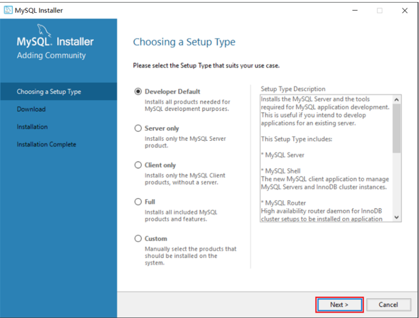
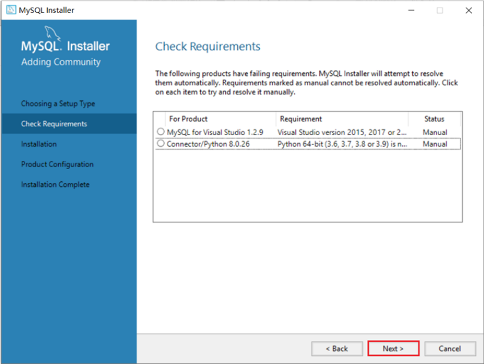
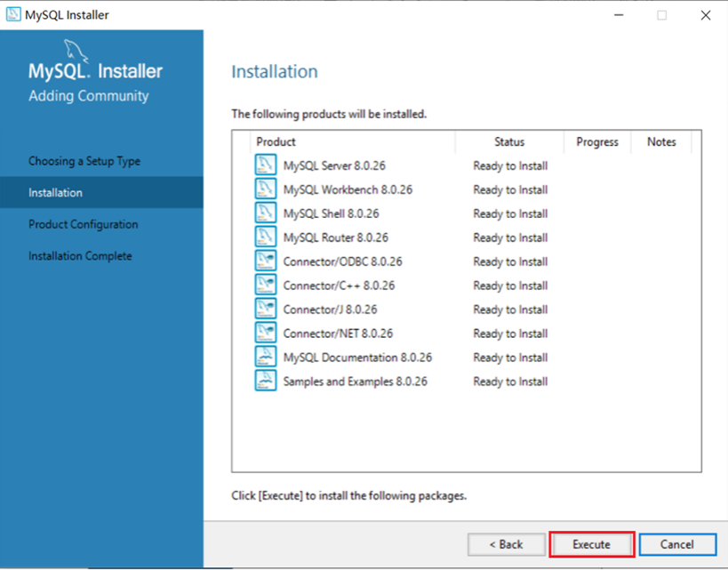
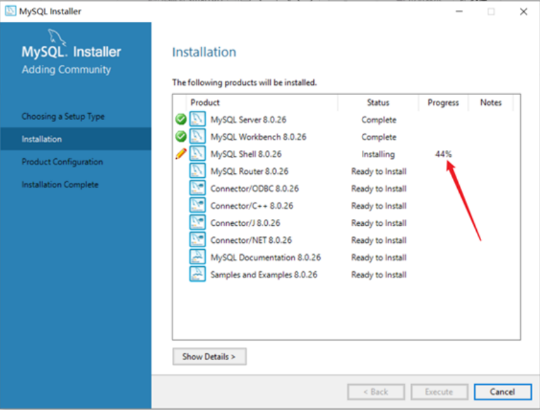
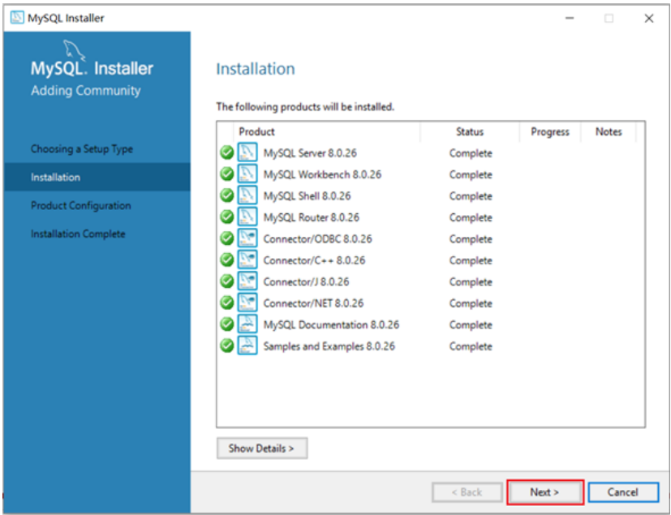
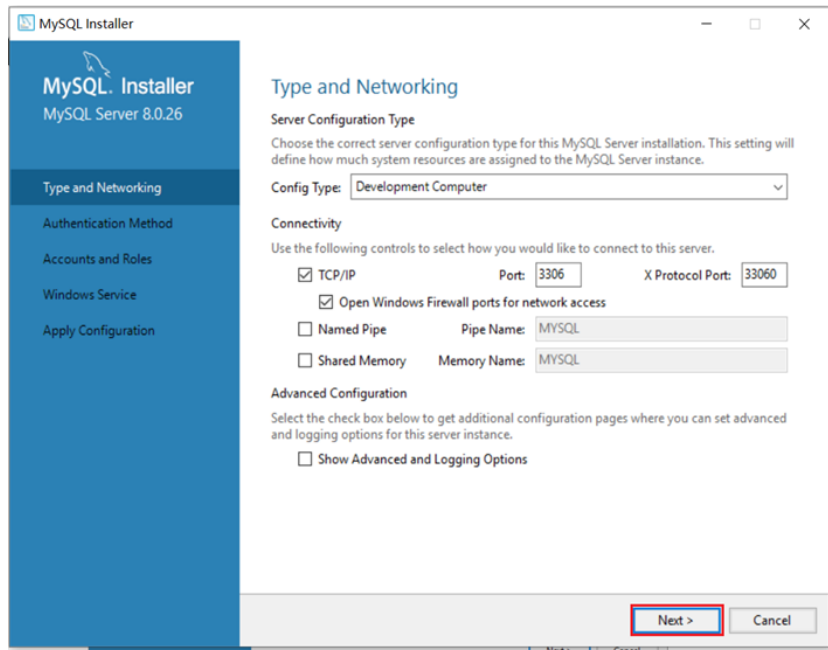
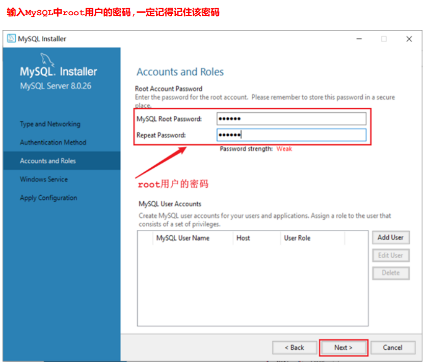
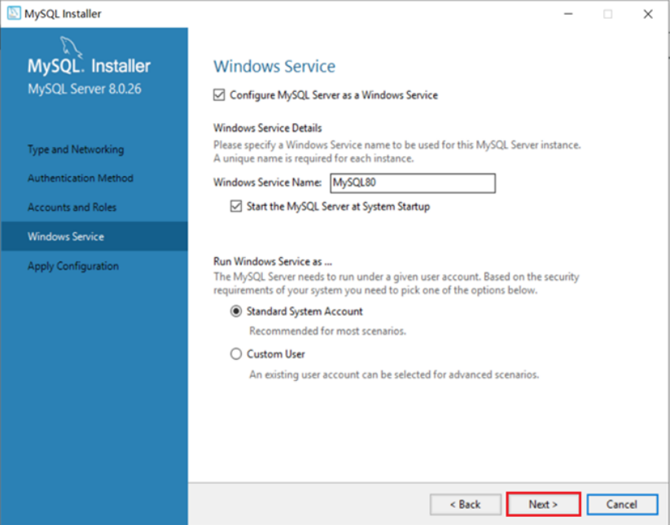
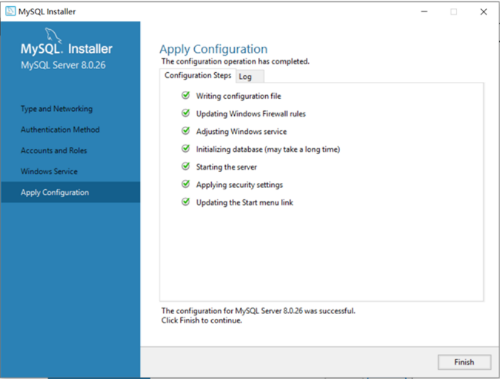
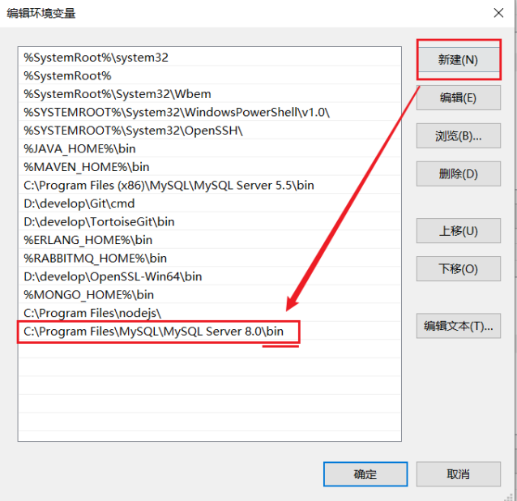

## 1、mysql的概念

| 名称      | 全称                              | 简称                               |
| ------- | ------------------------------- | -------------------------------- |
| 数据库     | 存储数据的仓库，数据是有组织的进行存储             | DataBase（DB）                     |
| 数据库管理系统 | 操纵和管理数据库的大型软件                   | DataBase ManagementSystem (DBMS) |
| SQL     | 操作关系型数据库的编程语言，定义了一套操作关系型数据库统一标准 | Structured QueryLanguage (SQL)   |

## 2、下载

版本1.2.1

下载地址：https://downloads.mysql.com/archives/installer/

## 3、安装

要想使用MySQL，我们首先先得将MySQL安装好，我们可以根据下面的步骤，一步一步的完成MySQL的
安装。
1). 双击官方下来的安装包文件
2). 根据安装提示进行安装













## 4、配置环境变量



## 5、启动停止

MySQL安装完成之后，在系统启动时，会自动启动MySQL服务，我们无需手动启动了。
当然，也可以手动的通过指令启动停止，以管理员身份运行cmd，进入命令行执行如下指令：

```
net start mysql80
net stop mysql80
```

注意 ： 上述的 mysql80 是我们在安装MySQL时，默认指定的mysql的系统服务名，不是固
定的，如果未改动，默认就是mysql80。

2). 方式二：使用系统自带的命令行工具执行指令

mysql [-h 127.0.0.1][-P 3306] -u root -p
参数：
-h : MySQL服务所在的主机IP
-P : MySQL服务端口号， 默认3306
-u : MySQL数据库用户名
-p ： MySQL数据库用户名对应的密码[]内为可选参数，如果需要连接远程的MySQL，需要加上这两个参数来指定远程主机IP、端口，如果
连接本地的MySQL，则无需指定这两个参数。

注意： 使用这种方式进行连接时，需要安装完毕后配置PATH环境变量。

