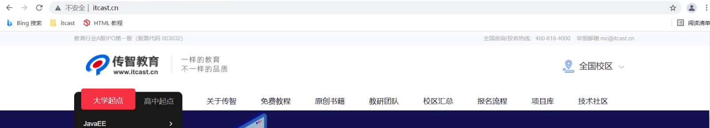
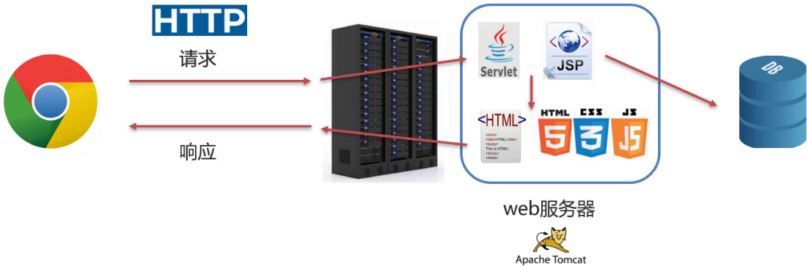

## 1.1 Web和JavaWeb的概念
==Web是全球广域网，也称为万维网(www)，能够通过浏览器访问的网站。==
在我们日常的生活中，经常会使用浏览器去访问`百度`、`京东`、`传智官网`等这些网站，这些网站统称为Web网站。如下就是通过浏览器访问传智官网的界面: 

顾名思义==JavaWeb就是用Java技术来解决相关web互联网领域的技术栈。==

## 1.2 JavaWeb技术栈
#### 1.2.1 B/S架构
什么是B/S架构?
B/S 架构：Browser/Server，浏览器/服务器 架构模式，它的特点是，客户端只需要浏览器，应用程序的逻辑和数据都存储在服务器端。浏览器只需要请求服务器，获取Web资源，服务器把Web资源发送给浏览器即可。大家可以通过下面这张图来回想下我们平常的上网过程:

* 打开浏览器访问百度首页，输入要搜索的内容，点击回车或百度一下，就可以获取和搜索相关的内容
* 思考下搜索的内容并不在我们自己的点上，那么这些内容从何而来？答案很明显是从百度服务器返回给我们的
* 日常百度的小细节，逢年过节百度的logo会更换不同的图片，服务端发生变化，客户端不需做任务事情就能获取最新内容
* 所以说B/S架构的好处:易于维护升级：服务器端升级后，客户端无需任何部署就可以使用到新的版本。
  了解了什么是B/S架构后，作为后台开发工程师的我们将来主要关注的是服务端的开发和维护工作。
#### 1.2.2 静态资源
* 静态资源主要包含HTML、CSS、JavaScript、图片等，主要负责页面的展示。
* HTML+CSS+JavaScript,使用这些技术我们就可以制作出效果比较丰富的网页，将来展现给用户。但是由于做出来的这些内容都是静态的，这就会导致所有的人看到的内容将是一模一样。
* 在日常上网的过程中，我们除了看到这些好看的页面以外，还会碰到很多动态内容，比如我们常见的百度登录效果:
  
  `张三`登录以后在网页的右上角看到的是 `张三`，而`李四`登录以后看到的则是`李四`。所以不同的用户访问相同的资源看到的内容大多数是不一样的，要想实现这样的效果，光靠静态资源是无法实现的。
#### 1.2.3 动态资源
* 动态资源主要包含Servlet、JSP等，主要用来负责逻辑处理。
* 动态资源处理完逻辑后会把得到的结果交给静态资源来进行展示，动态资源和静态资源要结合一起使用。
* 动态资源虽然可以处理逻辑，但是当用户来登录百度的时候，就需要输入`用户名`和`密码`,这个时候我们就又需要解决的一个问题是，用户在注册的时候填入的用户名和密码、以及我们经常会访问到一些数据列表的内容展示(如下图所示)，这些数据都存储在哪里?我们需要的时候又是从哪里来取呢?
  
#### 1.2.4 数据库
* 数据库主要负责存储数据。
* 整个Web的访问过程就如下图所示:
  
  (1)浏览器发送一个请求到服务端，去请求所需要的相关资源;
  (2)资源分为动态资源和静态资源,动态资源可以是使用Java代码按照Servlet和JSP的规范编写的内容;
  (3)在Java代码可以进行业务处理也可以从数据库中读取数据;
  (4)拿到数据后，把数据交给HTML页面进行展示,再结合CSS和JavaScript使展示效果更好;
  (5)服务端将静态资源响应给浏览器;
  (6)浏览器将这些资源进行解析;
  (7)解析后将效果展示在浏览器，用户就可以看到最终的结果。

#### 1.2.5 HTTP协议

* HTTP协议:主要定义通信规则
* 浏览器发送请求给服务器，服务器响应数据给浏览器，这整个过程都需要遵守一定的规则，之前大家学习过TCP、UDP，这些都属于规则，这里我们需要使用的是HTTP协议，这也是一种规则。

#### 1.2.6 Web服务器

* Web服务器:负责解析 HTTP 协议，解析请求数据，并发送响应数据
* 浏览器按照HTTP协议发送请求和数据，后台就需要一个Web服务器软件来根据HTTP协议解析请求和数据，然后把处理结果再按照HTTP协议发送给浏览器
* Web服务器软件有很多，我们课程中将学习的是目前最为常用的==Tomcat==服务器

到这为止，关于JavaWeb中用到的技术栈我们就介绍完了，这里面就只有HTTP协议、Servlet、JSP以及Tomcat这些知识是没有学习过的，所以整个Web核心主要就是来学习这些技术。

## 1.3 Web核心

(1)Request是从客户端向服务端发出的请求对象，

(2)Response是从服务端响应给客户端的结果对象，

(3)JSP是动态网页技术,

(4)会话技术是用来存储客户端和服务端交互所产生的数据，

(5)过滤器是用来拦截客户端的请求,

(6)监听器是用来监听特定事件,

(7)Ajax、Vue、ElementUI都是属于前端技术

这些技术都该如何来使用，我们后面会一个个进行详细的讲解。接下来我们来学习下HTTP、Tomcat和Servlet。 

