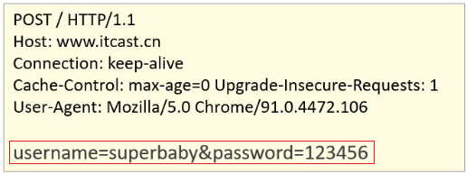

## 2.1 简介

**HTTP概念**

HyperText Transfer Protocol，超文本传输协议，规定了浏览器和服务器之间==数据传输的规则==。

- 数据传输的规则指的是请求数据和响应数据需要按照指定的格式进行传输。
- 如果想知道具体的格式，可以打开浏览器，点击`F12`打开开发者工具，点击`Network`来查看某一次请求的请求数据和响应数据具体的格式内容，如下图所示:


> 注意:在浏览器中如果看不到上述内容，需要清除浏览器的浏览数据。chrome浏览器可以使用ctrl+shift+Del进行清除。

==所以学习HTTP主要就是学习请求和响应数据的具体格式内容。==

**HTTP协议特点**

HTTP协议有它自己的一些特点，分别是:

- 基于TCP协议: 面向连接，安全

  TCP是一种面向连接的(建立连接之前是需要经过三次握手)、可靠的、基于字节流的传输层通信协议，在数据传输方面更安全。

- 基于请求-响应模型的:一次请求对应一次响应

  请求和响应是一一对应关系

- HTTP协议是无状态协议:对于事物处理没有记忆能力。每次请求-响应都是独立的

  无状态指的是客户端发送HTTP请求给服务端之后，服务端根据请求响应数据，响应完后，不会记录任何信息。这种特性有优点也有缺点，

  - 缺点:多次请求间不能共享数据
  - 优点:速度快

  请求之间无法共享数据会引发的问题，如:

  - 京东购物，`加入购物车`和`去购物车结算`是两次请求，
  - HTTP协议的无状态特性，加入购物车请求响应结束后，并未记录加入购物车是何商品
  - 发起去购物车结算的请求后，因为无法获取哪些商品加入了购物车，会导致此次请求无法正确展示数据

  具体使用的时候，我们发现京东是可以正常展示数据的，原因是Java早已考虑到这个问题，并提出了使用`会话技术(Cookie、Session)`来解决这个问题。

## 2.2 请求数据格式

### 2.2.1 格式介绍

请求数据总共分为三部分内容，分别是==请求行==、==请求头==、==请求体==


- 请求行: HTTP请求中的第一行数据，请求行包含三块内容，分别是 GET[请求方式] /[请求URL路径] HTTP/1.1[HTTP协议及版本]

  请求方式有七种,最常用的是GET和POST

- 请求头: 第二行开始，格式为key: value形式

  请求头中会包含若干个属性，常见的HTTP请求头有:

  ```
  Host: 表示请求的主机名
  User-Agent: 浏览器版本,例如Chrome浏览器的标识类似Mozilla/5.0 ...Chrome/79，IE浏览器的标识类似Mozilla/5.0 (Windows NT ...)like Gecko；
  Accept：表示浏览器能接收的资源类型，如text/*，image/*或者*/*表示所有；
  Accept-Language：表示浏览器偏好的语言，服务器可以据此返回不同语言的网页；
  Accept-Encoding：表示浏览器可以支持的压缩类型，例如gzip, deflate等。
  ```

   ==这些数据有什么用处?==

  举例说明:服务端可以根据请求头中的内容来获取客户端的相关信息，有了这些信息服务端就可以处理不同的业务需求，比如:

  - 不同浏览器解析HTML和CSS标签的结果会有不一致，所以就会导致相同的代码在不同的浏览器会出现不同的效果
  - 服务端根据客户端请求头中的数据获取到客户端的浏览器类型，就可以根据不同的浏览器设置不同的代码来达到一致的效果
  - 这就是我们常说的浏览器兼容问题

- 请求体: POST请求的最后一部分，存储请求参数

  

  如上图红线框的内容就是请求体的内容，请求体和请求头之间是有一个空行隔开。此时浏览器发送的是POST请求，为什么不能使用GET呢?这时就需要回顾GET和POST两个请求之间的区别了:

  - GET请求请求参数在请求行中，没有请求体，POST请求请求参数在请求体中
  - GET请求请求参数大小有限制，POST没有

### 2.2.2 实例演示

把 `代码\http` 拷贝到IDEA的工作目录中，比如`D:\workspace\web`目录，


使用IDEA打开


打开后，可以点击项目中的`html\19-表单验证.html`，使用浏览器打开，通过修改页面中form表单的method属性来测试GET请求和POST请求的参数携带方式。


**小结**:

1. 请求数据中包含三部分内容，分别是请求行、请求头和请求体
2. POST请求数据在请求体中，GET请求数据在请求行上

## 2.3 响应数据格式

### 2.3.1 格式介绍

响应数据总共分为三部分内容，分别是==响应行==、==响应头==、==响应体==


- 响应行：响应数据的第一行,响应行包含三块内容，分别是 HTTP/1.1[HTTP协议及版本] 200[响应状态码] ok[状态码的描述]

- 响应头：第二行开始，格式为key：value形式

  响应头中会包含若干个属性，常见的HTTP响应头有:

  ```
  Content-Type：表示该响应内容的类型，例如text/html，image/jpeg；
  Content-Length：表示该响应内容的长度（字节数）；
  Content-Encoding：表示该响应压缩算法，例如gzip；
  Cache-Control：指示客户端应如何缓存，例如max-age=300表示可以最多缓存300秒
  ```

- ```
  响应体： 最后一部分。存放响应数据

  上图中<html>...</html>这部分内容就是响应体，它和响应头之间有一个空行隔开。
  ```

  ​

### 2.3.2 响应状态码

参考: 资料/1.HTTP/《响应状态码.md》

关于响应状态码，我们先主要认识三个状态码，其余的等后期用到了再去掌握:

- 200  ok 客户端请求成功
- 404  Not Found 请求资源不存在
- 500 Internal Server Error 服务端发生不可预期的错误

### 2.3.3 自定义服务器

在前面我们导入到IDEA中的http项目中，有一个Server.java类，这里面就是自定义的一个服务器代码，主要使用到的是`ServerSocket`和`Socket`

```java
package com.itheima;

import sun.misc.IOUtils;

import java.io.*;
import java.net.ServerSocket;
import java.net.Socket;
import java.nio.charset.StandardCharsets;
import java.nio.file.Files;
/*
    自定义服务器
 */
public class Server {
    public static void main(String[] args) throws IOException {
        ServerSocket ss = new ServerSocket(8080); // 监听指定端口
        System.out.println("server is running...");
        while (true){
            Socket sock = ss.accept();
            System.out.println("connected from " + sock.getRemoteSocketAddress());
            Thread t = new Handler(sock);
            t.start();
        }
    }
}

class Handler extends Thread {
    Socket sock;

    public Handler(Socket sock) {
        this.sock = sock;
    }

    public void run() {
        try (InputStream input = this.sock.getInputStream()) {
            try (OutputStream output = this.sock.getOutputStream()) {
                handle(input, output);
            }
        } catch (Exception e) {
            try {
                this.sock.close();
            } catch (IOException ioe) {
            }
            System.out.println("client disconnected.");
        }
    }

    private void handle(InputStream input, OutputStream output) throws IOException {
        BufferedReader reader = new BufferedReader(new InputStreamReader(input, StandardCharsets.UTF_8));
        BufferedWriter writer = new BufferedWriter(new OutputStreamWriter(output, StandardCharsets.UTF_8));
        // 读取HTTP请求:
        boolean requestOk = false;
        String first = reader.readLine();
        if (first.startsWith("GET / HTTP/1.")) {
            requestOk = true;
        }
        for (;;) {
            String header = reader.readLine();
            if (header.isEmpty()) { // 读取到空行时, HTTP Header读取完毕
                break;
            }
            System.out.println(header);
        }
        System.out.println(requestOk ? "Response OK" : "Response Error");
        if (!requestOk) {
            // 发送错误响应:
            writer.write("HTTP/1.0 404 Not Found\r\n");
            writer.write("Content-Length: 0\r\n");
            writer.write("\r\n");
            writer.flush();
        } else {
            // 发送成功响应:

            //读取html文件，转换为字符串
            BufferedReader br = new BufferedReader(new FileReader("http/html/a.html"));
            StringBuilder data = new StringBuilder();
            String line = null;
            while ((line = br.readLine()) != null){
                data.append(line);
            }
            br.close();
            int length = data.toString().getBytes(StandardCharsets.UTF_8).length;

            writer.write("HTTP/1.1 200 OK\r\n");
            writer.write("Connection: keep-alive\r\n");
            writer.write("Content-Type: text/html\r\n");
            writer.write("Content-Length: " + length + "\r\n");
            writer.write("\r\n"); // 空行标识Header和Body的分隔
            writer.write(data.toString());
            writer.flush();
        }
    }
}
```

**小结**

1. 响应数据中包含三部分内容，分别是响应行、响应头和响应体
2. 掌握200，404，500这三个响应状态码所代表含义，分别是成功、所访问资源不存在和服务的错误