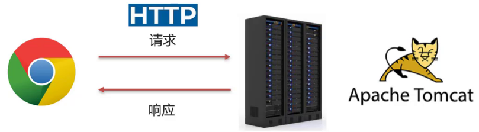
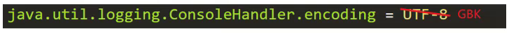

## 3 Tomcat

### 3.1 简介

#### 3.1.1 什么是Web服务器

Web服务器是一个应用程序（==软件==），对HTTP协议的操作进行封装，使得程序员不必直接对协议进行操作，让Web开发更加便捷。主要功能是"提供网上信息浏览服务"。



 Web服务器是安装在服务器端的一款软件，将来我们把自己写的Web项目部署到Web Tomcat服务器软件中，当Web服务器软件启动后，部署在Web服务器软件中的页面就可以直接通过浏览器来访问了。

**Web服务器软件使用步骤**

- 准备静态资源
- 下载安装Web服务器软件
- 将静态资源部署到Web服务器上
- 启动Web服务器使用浏览器访问对应的资源

上述内容在演示的时候，使用的是Apache下的Tomcat软件，至于Tomcat软件如何使用，后面会详细的讲到。而对于Web服务器来说，实现的方案有很多，Tomcat只是其中的一种，而除了Tomcat以外，还有很多优秀的Web服务器，比如:


Tomcat就是一款软件，我们主要是以学习如何去使用为主。具体我们会从以下这些方向去学习:

1. 简介: 初步认识下Tomcat
2. 基本使用: 安装、卸载、启动、关闭、配置和项目部署，这些都是对Tomcat的基本操作
3. IDEA中如何创建Maven Web项目
4. IDEA中如何使用Tomcat,后面这两个都是我们以后开发经常会用到的方式

首选我们来认识下Tomcat。

**Tomcat**

Tomcat的相关概念:

- Tomcat是Apache软件基金会一个核心项目，是一个开源免费的轻量级Web服务器，支持Servlet/JSP少量JavaEE规范。

- 概念中提到了JavaEE规范，那什么又是JavaEE规范呢?

  JavaEE: Java Enterprise Edition,Java企业版。指Java企业级开发的技术规范总和。包含13项技术规范:JDBC、JNDI、EJB、RMI、JSP、Servlet、XML、JMS、Java IDL、JTS、JTA、JavaMail、JAF。

- 因为Tomcat支持Servlet/JSP规范，所以Tomcat也被称为Web容器、Servlet容器。Servlet需要依赖Tomcat才能运行。

- Tomcat的官网: https://tomcat.apache.org/ 从官网上可以下载对应的版本进行使用。

**Tomcat的LOGO**


**小结**

1. Web服务器的作用

> 封装HTTP协议操作，简化开发
>
> 可以将Web项目部署到服务器中，对外提供网上浏览服务

​	    2.Tomcat是一个轻量级的Web服务器，支持Servlet/JSP少量JavaEE规范，也称为Web容器，Servlet容器。

### 3.2 基本使用

Tomcat总共分两部分学习，先来学习Tomcat的基本使用，包括Tomcat的==下载、安装、卸载、启动和关闭==。

#### 3.2.1 下载

直接从官网下载


#### 3.2.2 安装

Tomcat是绿色版,直接解压即可

- 在D盘的software目录下，将`apache-tomcat-8.5.68-windows-x64.zip`进行解压缩，会得到一个`apache-tomcat-8.5.68`的目录，Tomcat就已经安装成功。

  ==注意==，Tomcat在解压缩的时候，解压所在的目录可以任意，但最好解压到一个不包含中文和空格的目录，因为后期在部署项目的时候，如果路径有中文或者空格可能会导致程序部署失败。

- 打开`apache-tomcat-8.5.68`目录就能看到如下目录结构，每个目录中包含的内容需要认识下,

  

  bin:目录下有两类文件，一种是以`.bat`结尾的，是Windows系统的可执行文件，一种是以`.sh`结尾的，是Linux系统的可执行文件。

  webapps:就是以后项目部署的目录

  到此，Tomcat的安装就已经完成。

#### 3.2.3 卸载

可以直接删除目录即可

#### 3.2.4 启动

双击: bin\startup.bat


启动后，通过浏览器访问 `http://localhost:8080`能看到Apache Tomcat的内容就说明Tomcat已经启动成功。


==注意==: 启动的过程中，控制台有中文乱码，需要修改conf/logging.prooperties



#### 3.2.5 关闭

关闭有三种方式 

- 直接x掉运行窗口:强制关闭[不建议]
- bin\shutdown.bat：正常关闭
- ctrl+c： 正常关闭

#### 3.2.6 配置

**修改端口**

- Tomcat默认的端口是8080，要想修改Tomcat启动的端口号，需要修改 conf/server.xml


> 注: HTTP协议默认端口号为80，如果将Tomcat端口号改为80，则将来访问Tomcat时，将不用输入端口号。

**启动时可能出现的错误**

- Tomcat的端口号取值范围是0-65535之间任意未被占用的端口，如果设置的端口号被占用，启动的时候就会包如下的错误

  

- Tomcat启动的时候，启动窗口一闪而过: 需要检查JAVA_HOME环境变量是否正确配置


#### 3.2.7 部署

- Tomcat部署项目： 将项目放置到webapps目录下，即部署完成。

  - 将 `资料/2. Tomcat/hello` 目录拷贝到Tomcat的webapps目录下

  - 通过浏览器访问`http://localhost/hello/a.html`，能看到下面的内容就说明项目已经部署成功。

    

    但是呢随着项目的增大，项目中的资源也会越来越多，项目在拷贝的过程中也会越来越费时间，该如何解决呢?

- 一般JavaWeb项目会被打包称==war==包，然后将war包放到Webapps目录下，Tomcat会自动解压缩war文件

  - 将 `资料/2. Tomcat/haha.war`目录拷贝到Tomcat的webapps目录下

  - Tomcat检测到war包后会自动完成解压缩，在webapps目录下就会多一个haha目录

  - 通过浏览器访问`http://localhost/haha/a.html`，能看到下面的内容就说明项目已经部署成功。

    

至此，Tomcat的部署就已经完成了，至于如何获得项目对应的war包，后期我们会借助于IDEA工具来生成。

### 3.3 Maven创建Web项目

介绍完Tomcat的基本使用后，我们来学习在IDEA中如何创建Maven Web项目，学习这种方式的原因是以后Tomcat中运行的绝大多数都是Web项目，而使用Maven工具能更加简单快捷的把Web项目给创建出来，所以Maven的Web项目具体如何来构建呢?

在真正创建Maven Web项目之前，我们先要知道Web项目长什么样子，具体的结构是什么?

#### 3.3.1 Web项目结构

Web项目的结构分为:开发中的项目和开发完可以部署的Web项目,这两种项目的结构是不一样的，我们一个个来介绍下:

- Maven Web项目结构: 开发中的项目

  

- 开发完成部署的Web项目

  

  - 开发项目通过执行Maven打包命令==package==,可以获取到部署的Web项目目录
  - 编译后的Java字节码文件和resources的资源文件，会被放到WEB-INF下的classes目录下
  - pom.xml中依赖坐标对应的jar包，会被放入WEB-INF下的lib目录下

#### 3.3.2 创建Maven Web项目

介绍完Maven Web的项目结构后，接下来使用Maven来创建Web项目，创建方式有两种:使用骨架和不使用骨架

**使用骨架**

> 具体的步骤包含:
>
> 1.创建Maven项目
>
> 2.选择使用Web项目骨架
>
> 3.输入Maven项目坐标创建项目
>
> 4.确认Maven相关的配置信息后，完成项目创建
>
> 5.删除pom.xml中多余内容
>
> 6.补齐Maven Web项目缺失的目录结构

1. 创建Maven项目

   

2. 选择使用Web项目骨架

   

3. 输入Maven项目坐标创建项目

   

4. 确认Maven相关的配置信息后，完成项目创建

   

5. 删除pom.xml中多余内容，只留下面的这些内容，注意打包方式 jar和war的区别

   

6. 补齐Maven Web项目缺失的目录结构，默认没有java和resources目录，需要手动完成创建补齐，最终的目录结果如下

   

**不使用骨架**

> 具体的步骤包含:
>
> 1.创建Maven项目
>
> 2.选择不使用Web项目骨架
>
> 3.输入Maven项目坐标创建项目
>
> 4.在pom.xml设置打包方式为war
>
> 5.补齐Maven Web项目缺失webapp的目录结构
>
> 6.补齐Maven Web项目缺失WEB-INF/web.xml的目录结构

1. 创建Maven项目

   

2. 选择不使用Web项目骨架

   

3. 输入Maven项目坐标创建项目

   

4. 在pom.xml设置打包方式为war,默认是不写代表打包方式为jar

   

5. 补齐Maven Web项目缺失webapp的目录结构

   

6. 补齐Maven Web项目缺失WEB-INF/web.xml的目录结构

   

7. 补充完后，最终的项目结构如下:


   

上述两种方式，创建的web项目，都不是很全，需要手动补充内容，至于最终采用哪种方式来创建Maven Web项目，都是可以的，根据各自的喜好来选择使用即可。

**小结**

1.掌握Maven Web项目的目录结构

2.掌握使用骨架的方式创建Maven Web项目


> 3.掌握不使用骨架的方式创建Maven Web项目


### 3.4 IDEA使用Tomcat

- Maven Web项目创建成功后，通过Maven的package命令可以将项目打包成war包，将war文件拷贝到Tomcat的webapps目录下，启动Tomcat就可以将项目部署成功，然后通过浏览器进行访问即可。
- 然而我们在开发的过程中，项目中的内容会经常发生变化，如果按照上面这种方式来部署测试，是非常不方便的
- 如何在IDEA中能快速使用Tomcat呢?

在IDEA中集成使用Tomcat有两种方式，分别是==集成本地Tomcat==和==Tomcat Maven插件==

#### 3.4.1 集成本地Tomcat

目标: 将刚才本地安装好的Tomcat8集成到IDEA中，完成项目部署，具体的实现步骤

1. 打开添加本地Tomcat的面板

   

2. 指定本地Tomcat的具体路径

   

3. 修改Tomcat的名称，此步骤可以不改，只是让名字看起来更有意义，HTTP port中的端口也可以进行修改，比如把8080改成80

   

4. 将开发项目部署项目到Tomcat中

   

   扩展内容： xxx.war和 xxx.war exploded这两种部署项目模式的区别?

   - war模式是将WEB工程打成war包，把war包发布到Tomcat服务器上
   - war exploded模式是将WEB工程以当前文件夹的位置关系发布到Tomcat服务器上
   - war模式部署成功后，Tomcat的webapps目录下会有部署的项目内容
   - war exploded模式部署成功后，Tomcat的webapps目录下没有，而使用的是项目的target目录下的内容进行部署
   - 建议大家都选war模式进行部署，更符合项目部署的实际情况

5. 部署成功后，就可以启动项目，为了能更好的看到启动的效果，可以在webapp目录下添加a.html页面

   

6. 启动成功后，可以通过浏览器进行访问测试

   

7. 最终的注意事项

   

至此，IDEA中集成本地Tomcat进行项目部署的内容我们就介绍完了，整体步骤如下，大家需要按照流程进行部署操作练习。


#### 3.4.2 Tomcat Maven插件

在IDEA中使用本地Tomcat进行项目部署，相对来说步骤比较繁琐，所以我们需要一种更简便的方式来替换它，那就是直接使用Maven中的Tomcat插件来部署项目，具体的实现步骤，只需要两步，分别是:

1. 在pom.xml中添加Tomcat插件

   ```xml
   <build>
       <plugins>
       	<!--Tomcat插件 -->
           <plugin>
               <groupId>org.apache.tomcat.maven</groupId>
               <artifactId>tomcat7-maven-plugin</artifactId>
               <version>2.2</version>
           </plugin>
       </plugins>
   </build>
   ```

2. 使用Maven Helper插件快速启动项目，选中项目，右键-->Run Maven --> tomcat7:run


==注意:==

- 如果选中项目并右键点击后，看不到Run Maven和Debug Maven，这个时候就需要在IDEA中下载Maven Helper插件，具体的操作方式为: File --> Settings --> Plugins --> Maven Helper ---> Install,安装完后按照提示重启IDEA，就可以看到了。


- Maven Tomcat插件目前只有Tomcat7版本，没有更高的版本可以使用
- 使用Maven Tomcat插件，要想修改Tomcat的端口和访问路径，可以直接修改pom.xml

```xml
<build>
    <plugins>
    	<!--Tomcat插件 -->
        <plugin>
            <groupId>org.apache.tomcat.maven</groupId>
            <artifactId>tomcat7-maven-plugin</artifactId>
            <version>2.2</version>
            <configuration>
            	<port>80</port><!--访问端口号 -->
                <!--项目访问路径
					未配置访问路径: http://localhost:80/tomcat-demo2/a.html
					配置/后访问路径: http://localhost:80/a.html
					如果配置成 /hello,访问路径会变成什么?
						答案: http://localhost:80/hello/a.html
				-->
                <path>/</path>
            </configuration>
        </plugin>
    </plugins>
</build>
```

