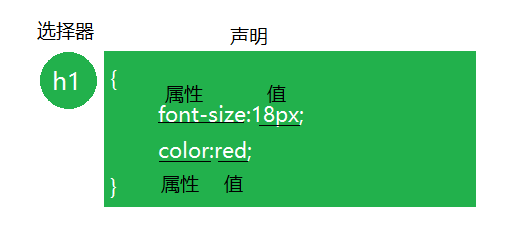
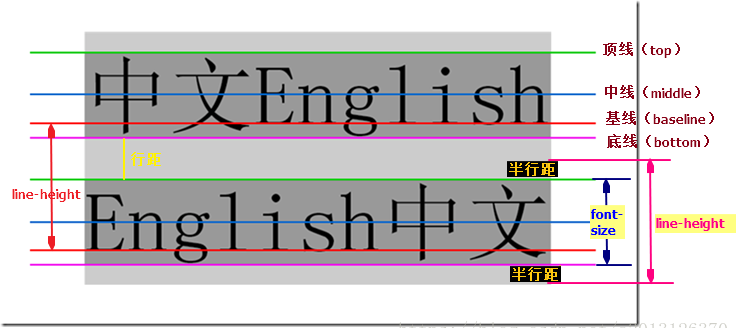
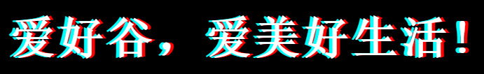
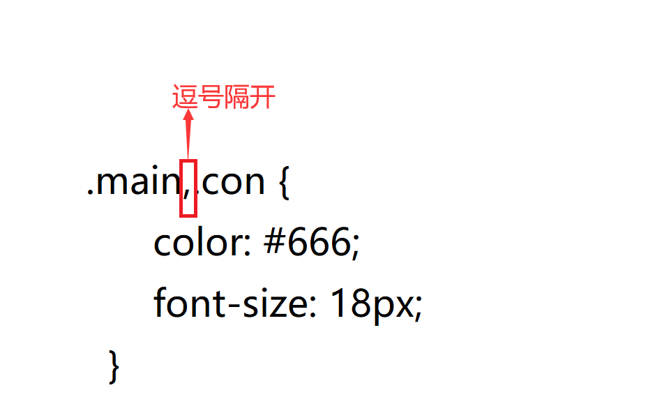
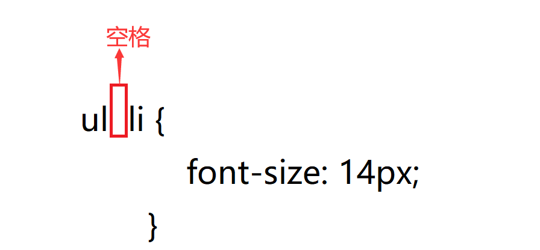
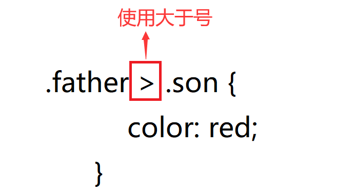

## 1. CSS简介

从HTML被发明开始，样式就以各种形式存在。不同的浏览器结合它们各自的样式语言为用户提供页面效果的控制。最初的HTML只包含很少的显示属性。
随着HTML的成长，为了满足页面设计者的要求，HTML添加了很多显示功能。但是随着这些功能的增加，HTML变的越来越杂乱，而且HTML页面也越来越臃肿。于是CSS便诞生了。

> 那么如何实现结构和样式的完全分离呢？

### 1.1 什么是CSS

简单来说，层叠样式表（Cascading Style Sheet）是一种专门用来控制界面外观风格的文档。
主要用于设置HTML页面中的文本内容（字体、大小、对齐方式等）、图片的外形（宽高、边框样式、边距等）以及版面的布局等外观显示样式。

CSS以HTML为基础，提供了丰富的功能，如字体、颜色、背景的控制及整体排版等，而且还可以针对不同的浏览器设置不同的样式。

### 1.2  CSS发展历史

1. 1996年 CSS 1.0 规范面世，其中加入了字体、样色等相关属性。
2. 1998年 CSS 2.0 规范推出，这个版本的 CSS 也是最广为人知的一个版本。
3. 2004年 CSS 2.1 规范推出，对 CSS 2.0 进行了一些小范围的修改，删除了一些浏览器支持不成熟的属性。
4. 2010年 CSS 3.0 规范推出，将 CSS3 分成了不同的模块，例如盒子模型、背景和边框、文字特效等模块。

## 2. CSS使用方式(3种)

### **2.1 行内样式**

```html
<!DOCTYPE html>
<html lang="en">
    <head>
        <title>This is title</title>
    </head>
    <body>
        <p style="font-size: 16px; color: red;">大家好</p>
    </body>
</html>
```

> 行内样式需要写到标签的 style 属性值中。

### ***2.2 内部样式表***

```html
<!DOCTYPE html>
<html lang="en">
    <head>
        <title>This is title</title>
        <style>
            p {
                font-size: 16px;
                color: red;
            }
        </style>
    </head>
    <body>
        <p>Hello everyone</p>
    </body>
</html>
```

> 内部样式需要写到 `<style>` 标签中。

### ***2.3 外部样式表***

- 链接式

将样式写到单独的文件中，文件的扩展名为 `.css`。例如，`index.css` 文件中有如下样式：

```css
p {
    font-size: 16px;
    color: red;
}
```

然后通过 `<link>` 元素将 `index.css` 文件引入到页面中：

```html
<!DOCTYPE html>
<html lang="en">
    <head>
        <title>This is title</title>
        <link rel="stylesheet" type="text/css" href="./css/index.css">
    </head>
    <body>
        <p>我是优秀的开发工程师</p>
    </body>
</html>
```

css使用方式总结

- 定义在外部文件（外链样式）：开发中主要是通过这种形式定义样式。（推荐）
- 在页面的头部定义（内联样式）：通过这种形式定义的样式只在本页面内生效。
- 定义在特定的元素身上（行内样式）：这种形式多用于测试，可维护性较差。（不推荐）

## 3. CSS基本语法

CSS 样式由一系列的规则集组成，规则集中有一条或多条样式声明。



- 选择器通常是您需要改变样式的 HTML 元素。
- 每条样式声明包含着一对属性名和属性值。
- 属性名和属性值之间以冒号（`:`）隔开。
- 样式规则之间以分号（`;`）隔开。

## 4. CSS字体样式属性

### 4.1 font-size:字号大小

font-size属性用于设置字号。推荐使用像素单位px。

#### 4.1.1 px

- px单位名称为像素，像素是固定大小的单元,用于屏幕媒体(即在电脑屏幕上读取)。
- 一个像素等于电脑屏幕上的一个点 (是你屏幕分辨率的最小分割)。
- 大多数浏览器的默认字体大小是16px。 

#### 4.1.2 em

em是相对字体长度单位。如果用于font-size属性本身，则是相对于父元素的font-size。

em单位有如下特点：

- em的值并不是固定的;
- em会继承父级元素的字体大小。

### 4.2 font-family:字体

font-family属性用于设置字体。网页中常用的字体有宋体、微软雅黑、黑体等，例如将网页中所有段落文本的字体设置为微软雅黑，可以使用如下CSS样式代码：

```css
p{ 
    font-family:"Arial","微软雅黑";
}
```

可以同时指定多个字体，中间以逗号隔开，表示如果浏览器不支持第一个字体，则会尝试下一个，直到找到合适的字体。

> 注意:
>
> 1. 现在网页中普遍使用16px、字体是微软雅黑。
> 2. 各种字体之间必须使用英文状态下的逗号隔开。
> 3. 如果字体名中包含空格、#、$等符号，则该字体必须加英文状态下的单引号或双引号，例如font-family: "Times New Roman";。
> 4. 尽量使用系统默认字体，保证在任何用户的浏览器中都能正确显示。

### 4.3 font-weight:字体粗细

字体加粗除了用 b 和 strong 标签之外，可以使用css 来实现。

font-weight属性用于定义字体的粗细，其可用属性值：normal、bold、bolder、lighter、100~900（100的整数倍）。

| 属性值     | 描述                                       |
| ------- | ---------------------------------------- |
| normal  | 默认值。定义标准的字符。                             |
| bold    | 定义粗体字符。                                  |
| bolder  | 定义更粗的字符。                                 |
| lighter | 定义更细的字符。                                 |
| 100~900 | 定义由粗到细的字符。400 等同于 normal，而 700 等同于 bold。 |

> 数字 400 等价于 normal，而 700 等价于 bold。 但是我们更喜欢用数字来表示。

### 4.4 font-style:字体风格

字体倾斜除了用 i 和 em 标签之外，可以使用css 来实现，但是css 是没有语义的。

font-style属性用于定义字体风格，如设置斜体、倾斜或正常字体，其可用属性值如下：

normal：默认值，浏览器会显示标准的字体样式。

italic：浏览器会显示斜体的字体样式。

oblique：浏览器会显示倾斜的字体样式。

> 注意:平时我们很少给文字加斜体，反而喜欢给斜体标签（em，i）改为普通模式。

### 4.5 font:综合设置字体样式 (重点)

font属性用于对字体样式进行综合设置，其基本语法格式如下：

```css
选择器{
    font: font-style  font-weight  font-size  font-family;
}
```

> 注意：
>
> 1.使用font属性时，必须按上面语法格式中的顺序书写，不能更换顺序，各个属性以空格隔开。
>
> 2.其中不需要设置的属性可以省略（取默认值），但必须保留font-size和font-family属性，否则font属性将不起作用。


## 5. CSS注释

CSS规则是使用     /*  需要注释的内容  */  进行注释的。

```css
p{
  font-size: 14px;                 /* 所有的字体是14像素大小*/
  }
```

## 6. 选择器

### 6.1 基本选择器（重点）

#### 6.1.1 标签选择器

```css
p {
    font-size: 16px;
    color: red;
}
```

> 选择页面中所有的 `<p>` 元素，给它们设置字体大小和颜色。

#### 6.1.2 Class 选择器

```css
.box {
    font-size: 20px;
    color: green;
}
```

> 选择页面中 class 属性值中包含 box 类名的所有元素，给它们设置字体大小和颜色。

#### 6.1.3 ID 选择器

```css
#nav {
    font-size: 24px;
    color: blue;
}
```

> 选择页面中 id 属性值是 nav 的元素，给它设置字体大小和颜色。

***id选择器和类选择器区别**

W3C标准规定，在同一个页面内，不允许有相同名字的id对象出现，但是允许相同名字的class。
类选择器（class） 好比人的名字，  是可以多次重复使用的。
id选择器 好比人的身份证号码，  全中国是唯一的， 不得重复。 只能使用一次。

#### 6.1.4 通配符选择器

```css
* {
    font-size: 24px;
    color: blue;
}
```

#### 6.1.5 总结-CSS的基本选择器

- 标签选择器：针对一类标签
- ID选择器：针对某一个特定的标签使用
- 类选择器：针对你想要的所有标签使用
- 通用选择器（通配符）：针对所有的标签都适用（不建议使用）

### 6.2伪类选择器(重点)

 伪类选择器用于向某些选择器添加特殊的效果，比如给链接添加特殊效果等。

为了和我们刚才学的类选择器相区别，类选择器是一个点比如 `.demo {}`   而我们的伪类选择器用 2个点 就是冒号比如  `:link{}`

#### 6.2.1 链接伪类选择器

```css
/* 未访问的链接 */
:link   
 /* 已访问的链接 */
:visited 
/* 鼠标移动到链接上 */
:hover
/* 选定的链接 */
:active
```

**提示：**

在 CSS 定义中，a:hover 必须位于 a:link 和 a:visited 之后，这样才能生效！

a:active 必须位于 a:hover 之后，这样才能生效！ 

> 注意:
>
> a:link会对拥有a标签的属性href=""，即拥有实际链接地址的a对象发生效果

## 7. CSS外观属性

### 7.1 color：文本颜色

| 属性名  | color                             |
| ---- | --------------------------------- |
| 属性值  | 预定义的颜色名 \| 十六进制值的颜色值 \| RGB颜色值    |
| 默认值  | 在不同浏览器中，默认值可能不同，但是在大部分浏览器中默认值为黑色。 |
| 描述   | 设置文本的颜色                           |

> 注意:
>
> 1.一般情况下颜色我们喜欢小写字母 比如 #ff0000。 
>
> 2.css颜色简写比如 #ff0000 可以简写为#f00， #ff00ff 简写为 #f0f。

### 7.2 颜色半透明(css3)

文字颜色到了CSS3我们可以采取半透明的格式了语法格式如下：

```css
/* a 是alpha透明的意思,取值范围 0~1之间  */
color: rgba(r,g,b,a)    
color: rgba(0,0,0,0.3)  
```

### 7.3 line-height：行间距

行高是指文本行基线间的垂直距离:基线与基线之间的距离。

| 属性名  | line-height               |
| ---- | ------------------------- |
| 属性值  | normal \|数字 \| 长度值 \| 百分比 |
| 默认值  | normal                    |
| 描述   | 设置文本的行高                   |

- normal：默认值，行高由浏览器自动处理。

- 数字：行高 = 数字 * 字体大小，例如，`line-height: 2;font-size: 16px;`，则行高等于：2 * 16px = 32px

- 长度值：使用长度值设置行高，例如，`line-height: 32px`。

  

> 基线（base line）并不是汉字文字的下端沿，而是英文字母“x”的下端沿。
>
> 一般项目中的页面的行高设置比字号大7~8像素左右就可以了, 比如当前使用14像素的字号，行高设为24像素左右合适。

### 7.4 text-align：水平对齐方式

| 属性名  | text-align                               |
| ---- | ---------------------------------------- |
| 属性值  | left \| right \| center \| justify       |
| 默认值  | 如果文本方向为ltr，则默认值为left；如果文本方向为rtl，则默认值为right |
| 描述   | 设置文本在水平方向上的对齐方式                          |

- **left：**内容左对齐。
- **center：**内容居中对齐。（重点）
- **right：**内容右对齐。
- **justify：**内容两端对齐，但对于强制打断的行（被打断的这一行）及最后一行（包括仅有一行文本的情况，因为它既是第一行也是最后一行）不做处理。

### 7.5 text-indent:首行缩进

text-indent属性用于设置首行文本的缩进，其属性值可为不同单位的数值、em字符宽度的倍数、或相对于浏览器窗口宽度的百分比%，允许使用负值, 建议使用em作为设置单位。

### 7.6 text-decoration：文本修饰

文本修饰

| 属性名  | text-decoration                          |
| ---- | ---------------------------------------- |
| 属性值  | none \| underline \| overline \| line-through |
| 默认值  | none                                     |
| 描述   | 对文本进行修饰                                  |

- **none：**指定文字无装饰
- **underline：**指定文字的装饰是下划线
- **overline：**指定文字的装饰是上划线
- **line-through：**指定文字的装饰是贯穿线

### 7.7 letter-spacing：字符间距

字符间距

| 属性名  | letter-spacing    |
| ---- | ----------------- |
| 属性值  | normal \| 长度值     |
| 默认值  | normal            |
| 描述   | 增加或减少字符间的空白（字符间距） |

- **normal：**默认间隔
- **长度值：**用长度值指定间隔。可以为负值。

### 7.8 word-spacing（单词）

   单词间距

| 属性名  | word-spacing      |
| ---- | ----------------- |
| 属性值  | normal \| length  |
| 默认值  | normal            |
| 描述   | 增加或减少单词间的空白(即字间隔) |

- **normal：**默认间隔
- **length：**用长度值指定间隔。可以为负值。

### 7.9 文字阴影(CSS3)

可以给文字添加阴影效果

```css
text-shadow:水平位置 垂直位置 模糊距离 阴影颜色;
```

| 值          | 描述               |
| :--------- | :--------------- |
| *h-shadow* | 必需。水平阴影的位置。允许负值。 |
| *v-shadow* | 必需。垂直阴影的位置。允许负值。 |
| *blur*     | 可选。模糊的距离。        |
| *color*    | 可选。阴影的颜色。        |

- 前两项是必须写的。  后两项可以选写。


- ```css
  /* 多重阴影 */
  text-shadow: -5px 0px cyan, 5px 0px red;
  ```



## 8. CSS书写规范

开始就形成良好的书写规范，是你专业化的开始。

### 8.1 标识符规范

【建议】小写。

示例：

```
/* good */
.username{
   color:red;
}

/* bad */
.USERNAME{
   COLOR:RED;
}
```

### 8.2 属性规范

【强制】 属性定义必须另起一行。

示例：

```
/* good */
.selector{
    margin: 0;
    padding: 0;
}

/* bad */
.selector { margin: 0; padding: 0; }
```

【强制】 属性定义后必须以分号结尾。

示例：

```
/* good */
.selector {
    margin: 0;
}

/* bad */
.selector {
    margin: 0
}
```

## 9. CSS复合选择器

复合选择器是由两个或多个基础选择器，通过不同的方式组合而成的,**目的是为了可以选择更准确更精细的目标元素标签**。

### 9.1 并集选择器

并集选择器（css选择器分组）是各个选择器通过**逗号**连接而成的，任何形式的选择器（包括标签选择器、class类选择器，id选择器等），都可以作为并集选择器的一部分。如果某些选择器定义的样式完全相同，或部分相同，就可以利用并集选择器为它们定义相同的CSS样式。



> 并集选择器和的意思，只要逗号隔开的，所有选择器都会执行后面样式。

### 9.2 后代选择器(重点)

后代选择器又称为包含选择器。

- 用来选择元素或元素组的**子孙后代**。
- 其写法就是把外层标签写在前面，内层标签写在后面，中间用**空格**分隔，先写爷爷父亲，在写儿子孙子。



### 9.3 子元素选择器（重点）

子元素选择器只能选择作为某元素子元素的元素。

- 子元素选择器只能选择作为某元素**子元素(亲儿子)**的元素。
- 其写法就是把父级标签写在前面，子级标签写在后面，中间跟一个 `>` 进行连接



> 这里的子指的是亲儿子不包含孙子,重孙子之类。

### 9.4 复合选择器总结

| 选择器    | 作用           | 特征         | 使用情况 | 隔开符号及用法                 |
| ------ | ------------ | ---------- | ---- | ----------------------- |
| 后代选择器  | 用来选择元素后代     | 是选择所有的子孙后代 | 较多   | 符号是**空格** .nav a        |
| 并集选择器  | 选择某些相同样式的选择器 | 可以用于集体声明   | 较多   | 符号是**逗号** .nav, .header |
| 子元素选择器 | 选择最近一级元素     | 只选亲儿子      | 较少   | 符号是**>**   .nav>p       |

### 9.5 综合练习

```html
<!-- 主导航栏 -->
<div class="nav">
    <ul>
        <li>
            <a href="">公司首页</a>
        </li>
        <li>
            <a href="">公司简介</a>
        </li>
        <li>
            <a href="">公司产品</a>
        </li>
        <li>
            <a href="">联系我们</a>
        </li>
    </ul>
    <em> 收藏本站 </em>
    <div> 联系我们:
        <em> 1234567890</em>
    </div> 
</div>
<!-- 侧导航栏 -->
<div class="sidebar">
    <div class="sidebarLeft">左侧导航栏</div>
    <div class="sidebarRight"><a href="#">登录</a></div>
</div>
```

在不修改以上代码的前提下，完成以下任务：

1. 主导航栏和侧导航栏里面文字都是18像素并且是微软雅黑。

2. 链接登录的颜色为红色。

3. 主导航栏里的列表中的文字颜色为深灰色。

4. 收藏本站要求字体加粗。

   > 我们网页的标签非常多，在不同地方会用到不同类型的选择器，以便更好的完成我们的网页。

## 10.标签显示模式（display）（重点）


```
display:none; 隐藏块
```

**什么是标签的显示模式？**

标签以什么方式进行显示，比如div 自己占一行， 比如span 一行可以放很多个

- 作用： 

  我们网页的标签非常多，再不同地方会用到不同类型的标签，以便更好的完成我们的网页。

- 标签的类型(分类)

  HTML标签一般分为块标签和行内标签两种类型，它们也称块元素和行内元素。

### 10.1 块级元素(block-level)

每个块元素通常都会独自占据一整行或多整行，可以对其设置宽度、高度、对齐等属性，常用于网页布局和网页结构的搭建。

```
常见的块元素有<h1>~<h6>、<p>、<div>、<ul>、<ol>、<li>等，其中<div>标签是最典型的块元素。
```

块级元素的特点：

（1）总是从新行开始。

（2）高度、宽度、行高、外边距以及内边距都可以控制。

（3）宽度默认是容器的100%。

（4）可以容纳内联元素和其他块元素。

### 10.2 行内元素(inline-level)

行内元素（内联元素）不占有独立的区域，仅仅靠自身的字体大小和图像尺寸来支撑结构，一般不可以设置宽度、高度、对齐等属性，常用于控制页面中文本的样式。

```
常见的行内元素有<a>、<strong>、<b>、<em>、<i>、<del>、<s>、<ins>、<u>、<span>等，其中<span>标签最典型的行内元素。
```

行内元素的特点：

（1）和相邻行内元素在一行上。

（2）高、宽无效，但水平方向的padding和margin可以设置，垂直方向的无效。

（3）默认宽度就是它本身内容的宽度。

（4）行内元素只能容纳文本或则其他行内元素。（a特殊）

> 注意:
>
> 1. 只有文字才能组成段落因此 p 里面不能放块级元素，同理还有这些标签h1,h2,h3,h4,h5,h6,dt，他们都是文字类块级标签，里面不能放其他块级元素。
> 2. 链接里面不能再放链接。

### 10.3 行内块元素（inline-block）

```
在行内元素中有几个特殊的标签——、<input />可以对它们设置宽高和对齐属性，有些资料可能会称它们为行内块元素。
```

行内块元素的特点：

（1）默认宽度就是它本身内容的宽度。

（2）宽度，高度，行高、外边距以及内边距都可以控制。

### 10.4 三种模式总结区别

| 元素模式  | 元素排列        | 设置样式        | 默认宽度     | 包含           |
| ----- | ----------- | ----------- | -------- | ------------ |
| 块级元素  | 一行只能放一个块级元素 | 可以设置宽度高度    | 容器的100%  | 容器级可以包含任何标签  |
| 行内元素  | 一行可以放多个行内元素 | 不可以直接设置宽度高度 | 它本身内容的宽度 | 容纳文本或则其他行内元素 |
| 行内块元素 | 一行放多个行内块元素  | 可以设置宽度和高度   | 它本身内容的宽度 |              |

### 10.5 总结-块级元素和行内元素分别有哪些？

1）行内元素有：a b span img input select strong（强调的语气）
2）块级元素有：div ul ol li dl dt dd h1 h2 h3 h4…p table form

### 10.6 标签显示模式转换 display

- 块转行内：display:inline;
- 行内转块：display:block;
- 块、行内元素转换为行内块： display: inline-block;

## 11. 背景样式（重点）

### 11.1 背景颜色

| 属性名  | background-color                         |
| ---- | ---------------------------------------- |
| 属性值  | 合法的颜色的名，比如：`red`；十六进制值，比如：`#ff0000`；RGB 值，比如：`rgb(255,0,0)` |
| 默认值  | transparent                              |
| 描述   | 设置背景颜色。                                  |

 示例如下：

```css
.box {
    /* 下面3种写法是等价的 */
    background-color: red;
    background-color: rgb(255, 0, 0);
    background-color: #ff0000;
}
```

### 11.2 背景图片

| 属性名  | background-image |
| ---- | ---------------- |
| 属性值  | 图片所在路径           |
| 默认值  | none             |
| 描述   | 设置背景图片。          |

 示例如下：

```css
.box {
    background-image: url("./logo.jpg");
}
```

### 11.3 图片重复方式

| 属性名  | background-repeat                        |
| ---- | ---------------------------------------- |
| 属性值  | repeat \| repeat-x \| repeat-y \| no-repeat |
| 默认值  | repeat                                   |
| 描述   | 设置背景图片。                                  |

   **属性值**

| 值         | 描述                    |
| --------- | --------------------- |
| repeat    | 默认。背景图像将在垂直方向和水平方向重复。 |
| repeat-x  | 背景图像将在水平方向重复。         |
| repeat-y  | 背景图像将在垂直方向重复。         |
| no-repeat | 背景图像将仅显示一次。           |

示例如下：

```css
.box {
    /* repeat 默认值，默认情况下，在水平和垂直方向上都重复*/
    background-repeat: repeat;
    background-repeat: repeat-x;
    background-repeat: repeat-y;
    background-repeat: no-repeat;
}
```

### 11.4 图片位置(重点)

| 属性名  | background-position  |
| ---- | -------------------- |
| 属性值  | 长度 \| 百分比 \| 表示方位的单词 |
| 默认值  | 0% 0%                |
| 描述   | 背景图片的位置              |

示例如下：

```css
/*
    水平：left center right
    垂直：top  center bottom
*/

.box {
    background-position: 40px 40px;（水平位置、垂直位置）
    background-position: 20% 20%;
    background-position: right bottom;
}
```


#### 11.4.2 为什么需要CSS精灵技术


图所示为网页的请求原理图，当用户访问一个网站时，需要向服务器发送请求，网页上的每张图像都要经过一次请求才能展现给用户。

然而，一个网页中往往会应用很多小的背景图像作为修饰，当网页中的图像过多时，服务器就会频繁地接受和发送请求，这将大大降低页面的加载速度。

现在我们来回答为什么需要精灵技术？

> **为了有效地减少服务器接受和发送请求的次数，提高页面的加载速度。**

#### 11.4.3 精灵技术

CSS 精灵其实是将网页中的一些背景图像整合到一张大图中（精灵图），然而，各个网页元素通常只需要精灵图中不同位置的某个小图，要想精确定位到精灵图中的某个小图。

这样，当用户访问该页面时，只需向服务发送一次请求，网页中的背景图像即可全部展示出来。

我们需要使用CSS的

- background-image
- background-repeat
- background-position属性进行背景定位，
- 其中最关键的是使用background-position 属性精确地定位。

> 注意:
>
> css精灵技术主要针对于背景图片，插入的图片img 是不需要这个技术的。
>
> 1. 精确测量，每个小背景图片的大小和 位置。
> 2. 给盒子指定小背景图片时， 背景定位基本都是负值。

### 11.5 简写属性

| 属性名  | background                   |
| ---- | ---------------------------- |
| 属性值  | color image  repeat position |
| 默认值  | 每个属性的默认值                     |
| 描述   | 设置背景图片是否随内容滚动                |

示例如下：

```css
.box {
    background: #00ff00 url("index.png") no-repeat fixed center;
}
```

### 11.6 背景透明(CSS3)

CSS3支持背景半透明的写法语法格式是:

```css
background: rgba(0,0,0,0.3);
```

 最后一个参数是alpha 透明度  取值范围 0~1之间

 注意：  背景半透明是指盒子背景半透明， 盒子里面的内容不收影响。

### 11.7 背景缩放(CSS3)

通过background-size设置背景图片的尺寸，就像我们设置img的尺寸一样，在移动Web开发中做屏幕适配应用非常广泛。

其参数设置如下：

a) 可以设置长度单位(px)（img大小一样）或百分比（设置百分比时，参照盒子的宽高）

b) 设置为cover时，会自动调整缩放比例，保证图片始终填充满背景区域，如有溢出部分则会被隐藏。我们平时用的cover 最多

c) 设置为contain会自动调整缩放比例，保证图片始终完整显示在背景区域。

```css
background-image: url('images/bg.jpg');
background-size: 300px 100px;
/* background-size: contain; */
/* background-size: cover; */
```

> 注意:background-size属性一定要写在background属性后面。

### 11.8 背景总结

| 属性                  | 作用      | 值                                        |
| ------------------- | :------ | :--------------------------------------- |
| background-color    | 背景颜色    | 预定义的颜色值/十六进制/RGB代码                       |
| background-image    | 背景图片    | url(图片路径)                                |
| background-repeat   | 是否平铺    | repeat/no-repeat/repeat-x/repeat-y       |
| background-position | 背景位置    | length/position    分别是x  和 y坐标， 切记 如果有 精确数值单位，则必须按照先X 后Y 的写法 |
| 背景简写                | 更简单     | 背景颜色 背景图片地址 背景平铺 背景滚动 背景位置;  他们没有顺序      |
| 背景透明                | 让盒子半透明  | background: rgba(0,0,0,0.3);   后面必须是 4个值 |
| 背景缩放                | 背景图片的尺寸 | 长度单位、cover、contain                       |

导航案例

```html
<head>
    <style>		
        a {
            width: 150px;
            height: 50px;
            /* 把a行内元素转换为行内块元素 */
            display: inline-block;
            /* 文字水平居中 */
            text-align: center;
            /* 我们设定行高等于盒子的高度，就可以使文字垂直居中 */
            line-height: 50px;
            /* 字体颜色 */
            color: #666;
            /* 取消下划线 文本装饰 */
            text-decoration: none;
        }
        a:hover {  /* 鼠标经过 给我们的链接添加背景图片*/
            background: url(images/btn.png) no-repeat; 
        }
    </style>
</head>
<body>
    <a href="#">首页</a>
    <a href="#">业务介绍</a>
    <a href="#">关于我们</a>
    <a href="#">联系我们</a>
</body>
```

## 12. list-style 属性

list-style 简写属性在一个声明中设置所有的列表属性。

可以按顺序设置如下属性：

- list-style-type
- list-style-position
- list-style-image

例如:把图像设置为列表中的列表项目标记：

```css
ul
  {
  	list-style:square inside url(media/arrow.gif);
  }
```

### 12.1 list-style-type

| 值      | 描述         |
| :----- | :--------- |
| none   | 无标记。       |
| disc   | 默认。标记是实心圆。 |
| circle | 标记是空心圆。    |
| square | 标记是实心方块    |

### 12.2 list-style-position

| 值       | 描述                                       |
| :------ | :--------------------------------------- |
| inside  | 列表项目标记放置在文本以内，且环绕文本根据标记对齐。               |
| outside | 默认值。保持标记位于文本的左侧，列表项目标记放置在文本以外，且环绕文本不根据标记对齐。 |

### 12.3 list-style-image

| 值     | 描述         |
| :---- | :--------- |
| *URL* | 图像的路径。     |
| none  | 默认。无图形被显示。 |

## 13. CSS 三大特性

层叠,继承,优先级是我们学习CSS 必须掌握的三个特性。

### 13.1 CSS层叠性

- 所谓层叠性是指多种CSS样式的叠加,就是css处理冲突的能力。

**一般情况下，如果出现样式冲突，则会按照CSS书写的顺序，以最后的样式为准。**

当同一个元素被两个选择器选中时，CSS会根据选择器的权重决定使用哪一个选择器。权重低的选择器效果会被权重高的选择器效果覆盖（层叠）。

可以这样理解权重：这个选择器对于这个元素的重要性。

### 13.2  CSS继承性

所谓继承性是指书写CSS样式表时，子标签会继承父标签的某些样式，如文本颜色和字号。想要设置一个可继承的属性，只需将它应用于父元素即可。

> 注意：
>
> 1.**所以对于字体、文本属性等网页中通用的样式可以使用继承。**例如，字体、字号、颜色、行距等可以在body元素中统一设置，然后通过继承影响文档中所有文本。
>
> 2.并不是所有的CSS属性都可以继承，例如，下面的属性就不具有继承性：边框、外边距、内边距、背景、定位、元素高属性。

### 13.3  CSS优先级

定义CSS样式时，经常出现两个或更多规则应用在同一元素上，这时就会出现优先级的问题,即考虑权重的问题。

**!important>行内样式表>ID选择器>类选择器>标签选择器>通配符>继承的样式>浏览器默认样式**

在考虑权重时，初学者还需要注意一些特殊的情况，具体如下：

- 继承样式的权重为0。即在嵌套结构中，不管父元素样式的权重多大，被子元素继承时，他的权重都为0，也就是说子元素定义的样式会覆盖继承来的样式。
- 行内样式优先。应用style属性的元素，其行内样式的权重非常高，可以理解为远大于100。总之，他拥有比上面提高的选择器都大的优先级。
- 权重相同时，CSS遵循就近原则。也就是说靠近元素的样式具有最大的优先级，或者说排在最后的样式优先级最大。 
- CSS定义了一个!important命令，该命令被赋予最大的优先级。也就是说不管权重如何以及样式位置的远近，!important都具有最大优先级。

| 继承或者* 的贡献值      | 0,0,0,0 |
| --------------- | ------- |
| 每个元素（标签）贡献值为    | 0,0,0,1 |
| 每个类，伪类贡献值为      | 0,0,1,0 |
| 每个ID贡献值为        | 0,1,0,0 |
| 每个行内样式贡献值       | 1,0,0,0 |
| 每个!important贡献值 | ∞ 无穷大   |

**权重是可以叠加的**

 比如的例子：

| 选择器        | 权重      |
| ---------- | ------- |
| div ul  li | 0,0,0,3 |
| .nav ul li | 0,0,1,2 |
| a:hover    | 0,0,1,1 |
| .nav a     | 0,0,1,1 |
| #nav p     | 0,1,0,1 |

> 注意:
>
> 1.数位之间没有进制 比如说： 0,0,0,5 + 0,0,0,5 =0,0,0,10 而不是 0,0, 1, 0， 所以不会存在10个div能赶上一个类选择器的情况。
>
> 2.继承的权重是 0

