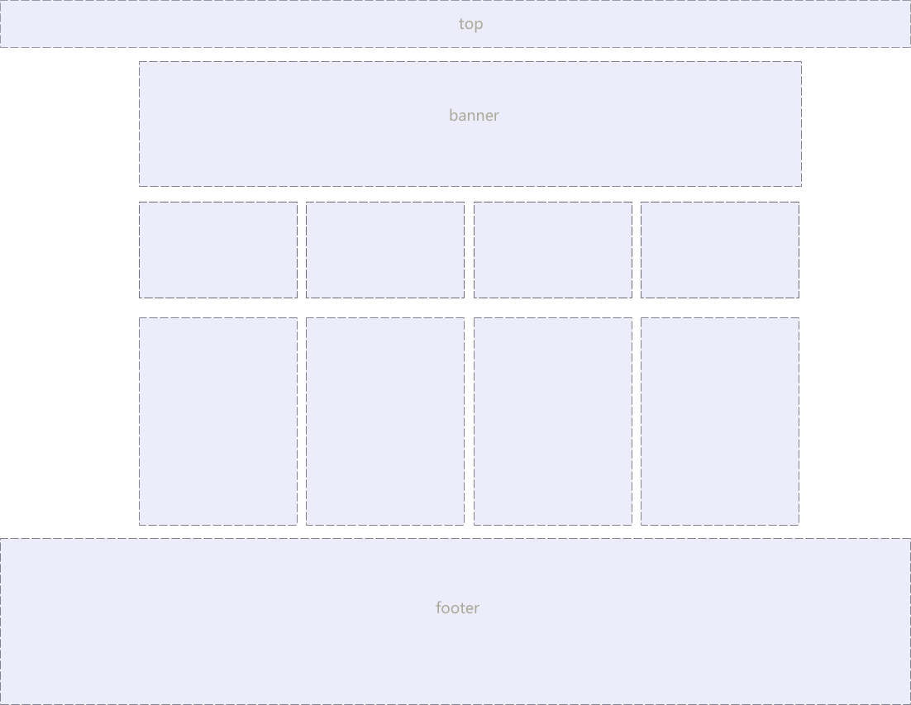

## 1. 元素的显示与隐藏

```
在CSS中有三个显示和隐藏的单词比较常见，我们要区分开，他们分别是 display visibility 和 overflow。
```

他们的主要目的是让一个元素在页面中消失，但是不在文档源码中删除。 最常见的是网站广告。

最小宽度和最大宽度

```
width:100%;屏幕有多大宽度就是多大
min-width：1300px;大于等于1300px

```


### 1.1 display 显示

```
display 设置或检索对象是否及如何显示。

display : none 隐藏对象 与它相反的是 display:block 除了转换为块级元素之外，同时还有显示元素的意思。

特点： 隐藏之后，不再保留位置。
```

### 1.2 visibility 可见性

设置或检索是否显示对象。

```
visible : 　对象可视

hidden : 　对象隐藏
```

特点： 隐藏之后，继续保留原有位置。

### 1.3 overflow 溢出

检索或设置当对象的内容超过其指定高度及宽度时如何管理内容。

```
visible : 　不剪切内容也不添加滚动条。

auto : 　 超出自动显示滚动条，不超出不显示滚动条

hidden : 　不显示超过对象尺寸的内容，超出的部分隐藏掉

scroll : 　不管超出内容否，总是显示滚动条
```

### 1.4 opacity 属性(重点)

```
opacity 属性是设置元素的不透明级别
```

**语法**

```
opacity: value|inherit;
```

| 值       | 描述                               |
| ------- | -------------------------------- |
| *value* | 规定不透明度。从 0.0 （完全透明）到 1.0（完全不透明）。 |
| inherit | 应该从父元素继承 opacity 属性的值。           |

### 1.5显示与隐藏总结

| 属性             | 区别          | 用途                                       |
| -------------- | ----------- | ---------------------------------------- |
| **display**    | 隐藏对象，不保留位置  | 配合后面js做特效，比如下拉菜单，原先没有，鼠标经过，显示下拉菜单， 应用极为广泛 |
| **visibility** | 隐藏对象，保留位置   | 使用较少                                     |
| **overflow**   | 只是隐藏超出大小的部分 | 1. 可以清除浮动 2. 保证盒子里面的内容不会超出该盒子范围          |
| opacity        | 规定不透明度      | 从 0.0 （完全透明）到 1.0（完全不透明）                 |

## 2.vertical -align 垂直对齐

以前我们讲过让带有宽度的块级元素居中对齐，是

```
margin: 0 auto;
```

以前我们还讲过让文字居中对齐，是 

```
text-align: center;
```

但是我们从来没有讲过有垂直居中的属性， 我们的妈妈一直很担心我们的垂直居中怎么做。

```
vertical-align 垂直对齐， 这个看上去很美好的一个属性， 实际有着不可捉摸的脾气，否则我们也不会这么晚来讲解。
```


```css
vertical-align : baseline |top |middle |bottom 
```

设置或检索对象(图片、表单)内容的垂直对其方式，样式设定到图片或表单的选择器上。 

| 描述                   | 值        |
| -------------------- | -------- |
| 默认。元素放置在父元素的基线上。     | baseline |
| 把元素的顶端与行中最高元素的顶端对齐   | top      |
| 把此元素放置在父元素的中部。       | middle   |
| 把元素的顶端与行中最低的元素的顶端对齐。 | bottom   |

```
vertical-align 不影响块级元素中的内容对齐，它只针对于 行内元素或者行内块元素，特别是行内块元素， **通常用来控制图片/表单与文字的对齐**。
```


```
所以我们知道，我们可以通过vertical-align 控制图片和文字的垂直关系了。 默认的图片会和文字基线对齐。
```

## 3. 多媒体标签

```
- embed：标签定义嵌入的内容
- audio：播放音频
- video：播放视频
```

### 3.1 多媒体 embe d（会使用）

```html
embed可以用来插入各种多媒体，格式可以是 Midi、Wav、AIFF、AU、MP3等等。url为音频或视频文件及其路径，可以是相对路径或绝对路径。我们这里只讲解 插入网络视频， 后面H5会讲解 audio 和video 视频多媒体。 
<embed height=498 width=510 src='https://player.youku.com/embed/XNTE4NDgxOTQyOA=='  frameborder=0 'allowfullscreen'></embed>
```


 优酷，土豆，爱奇艺，腾讯、乐视等等

1. 先上传   
2. 在分享

### 3.2 多媒体 audi o

HTML 5通过 audi o 标签来解决音频播放的问题。

使用相当简单，如下图所示

 

并且可以通过附加属性可以更友好控制音频的播放，如：

```css
controls 是否显不默认播放控件
autoplay 自动播放(目前很多浏览器不支持自动播放)
loop 循环播放
```

由于版权等原因，不同的浏览器可支持播放的格式是不一样的，如下图供参考

 

多浏览器支持的方案，如下图

 


### 3.3 多媒体 vide o

HTML 5通过  vide o  标签来解决音频播放的问题。

同音频播放一样， vide o 使用也相当简单，如下图

 

同样，通过附加属性可以更友好的控制视频的播放

```css
autoplay 自动播放（18年开始，谷歌浏览器不支持自动播放）
muted 静音播放
controls 是否显示默认播放控件
loop 循环播放
width 设置播放窗口宽度
height 设置播放窗口的高度
```

由于版权等原因，不同的浏览器可支持播放的格式是不一样的，如下图供参考

 

**多浏览器支持的方案，如下图******


## 4.字体图标

图片是有诸多优点的，但是缺点很明显，比如图片不但增加了总文件的大小，还增加了很多额外的"http请求"，这都会大大降低网页的性能的。更重要的是图片不能很好的进行“缩放”，因为图片放大和缩小会失真。 我们后面会学习移动端响应式，很多情况下希望我们的图标是可以缩放的。此时，一个非常重要的技术出现了， 这就是字体图标（iconfon t)  。

### 4.1 字体图标优点

可以做出跟图片一样可以做的事情,改变透明度、旋转度，等..
但是本质其实是文字，可以很随意的改变颜色、产生阴影、透明效果等等...
本身体积更小，但携带的信息并没有削减。
几乎支持所有的浏览器。
移动端设备必备良药...

### 4.2 字体图标使用流程

总体来说，字体图标按照如下流程：


### 4.3 设计字体图标

```
假如图标是我们公司单独设计，那就需要第一步了，这个属于UI设计人员的工作， 他们在 illustrator 或 Sketch 这类矢量图形软件里创建 icon图标， 之后保存为svg格式，然后给我们前端人员就好了。 
```

### 4.4 上传生成字体包

   当UI设计人员给我们svg文件的时候，我们需要转换成我们页面能使用的字体文件， 而且需要生成的是兼容性的适合各个浏览器的。

**阿里icon font字库**

http://www.iconfont.cn/

这个是阿里巴巴M2UX的一个icon font字体图标字库，包含了淘宝图标库和阿里妈妈图标库。可以使用AI制作图标上传生成。 一个字，免费，免费！！

**fontello**

[http://fontello.com/](http://fontello.com/)

在线定制你自己的ico n fon t字体图标字库，也可以直接从GitHub下载整个图标集，该项目也是开源的。

### 4.4 字体引入到HTML

得到压缩包之后，最后一步，是最重要的一步了， 就是字体文件已经有了，我们需要引入到我们页面中。

1. 首先把以下文件放入到 font s文件夹里面。 通俗的做法。

   

2. 三种使用字体图标方式

   ​


3. 根据资料提供的demo _index html文件

   


### 4.5 追加新图标到原来库里面

 如果工作中，原来的字体图标不够用了，我们需要添加新的字体图标，但是原来的不能删除，继续使用，此时我们需要这样做:

重新下载最先的文件,替换原来的文件,要注意文件名称和路径要和原来文件相同。

## 5. CSS的书写顺序

```
（1）定位属性：position  display  float  left  top  right  bottom   overflow  clear   z-index

（2）自身属性：width  height  padding  border  margin   background

（3）文字样式：font-family   font-size   font-style   font-weight   font-varient   color   

（4）文本属性：text-align   vertical-align   text-wrap   text-transform   text-indent    text-decoration   letter-spacing    word-spacing    white-space   text-overflow

（5）css3中新增属性：content   box-shadow   border-radius  transform……
```

按照上述1 2 3 4 5的顺序进行书写。

```
目的：减少浏览器reflow（回流），提升浏览器渲染dom的性能
```

原理：[浏览器的渲染流程](https://www.yuque.com/momoko-kxh7b/dzsswc/yt9sc8)

## 6. 版心和布局流程

```
阅读报纸时容易发现，虽然报纸中的内容很多，但是经过合理地排版，版面依然清晰、易读。同样，在制作网页时，要想使页面结构清晰、有条理，也需要对网页进行“排版”。

“版心”(可视区) 是指网页中主体内容所在的区域。一般在浏览器窗口中水平居中显示，常见的宽度值为960px、980px、1000px、1200px等。
```

### 6.1 布局流程

为了提高网页制作的效率，布局时通常需要遵守一定的布局流程，具体如下：

```
1、确定页面的版心（可视区）。

2、分析页面中的行模块，以及每个行模块中的列模块。

3、制作HTML结构 。

4、CSS初始化，然后开始运用盒子模型的原理，通过DIV+CSS布局来控制网页的各个模块。
```

### 6.2 一列固定宽度且居中


最为常用的结构

### 6.3 两列左窄右宽型


比如:[小米官网](https://www.mi.com/)

### 6.4 通栏平均分布型



比如:[中岚签证](http://www.clantrip.com/)


- ​

