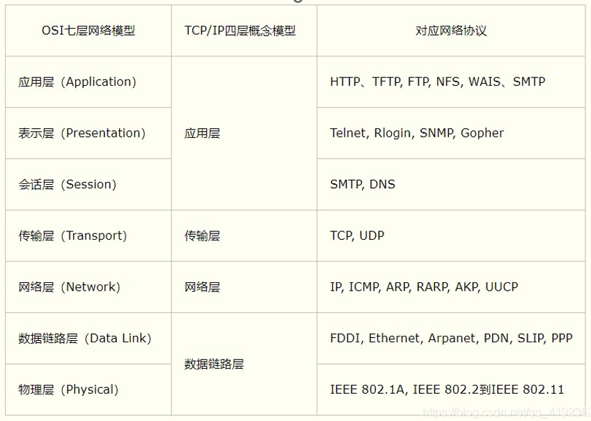
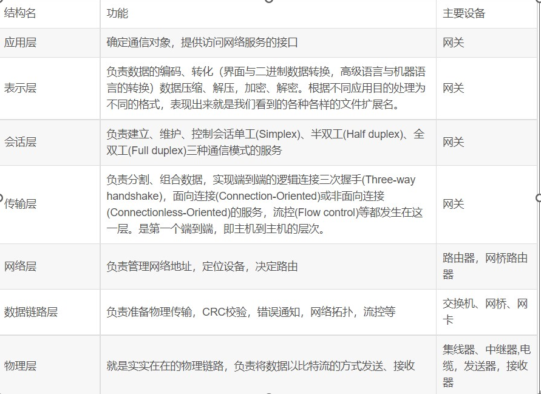
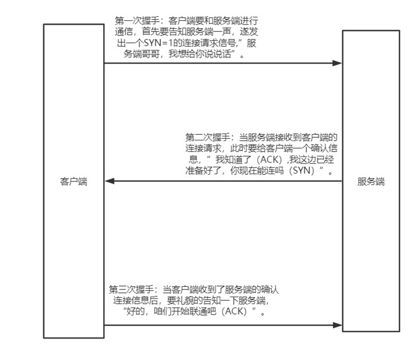
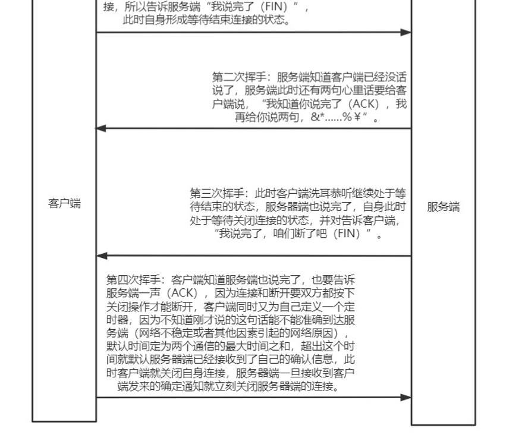
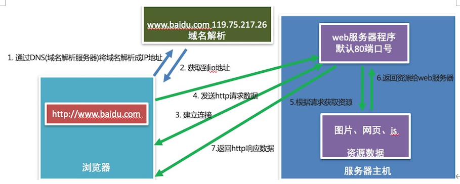

## 1.网络七层架构&四层架构





## 2.IP地址的介绍

### **2.1概念**

IP 地址就是**标识网络中设备的唯一地址**

**说明**:

IP 地址分为两类：**IPv4**和**IPv6**

IPv4 是目前使用的ip地址 

IPv6 是未来使用的ip地址 

IPv4 是由点分十进制组成

IPv6 是由冒号十六进制组成

### **2.2作用**

**IP地址的作用是**标识网络中唯一的一台设备的，也就是说通过IP地址能够找到网络中某台设备。

### **2.3如何查看**

Linux 和 MacOS 使用 **ifconfig (ip -a)** 这个命令 

Windows 使用 **ipconfig** 这个命令(通过 cmd 或 powershell 启动命令行终端)

**说明**:

**ifconfig**和**ipconfig**都是查看网卡信息的，网卡信息中包括这个设备对应的IP地址

192.168.1.107是设备在网络中的IP地址

127.0.0.1表示本机地址，提示：如果和自己的电脑通信就可以使用该地址。

127.0.0.1该地址对应的域名是 **localhost** ， **域名是**** ip ****地址的别名** ，通过域名能解析出一个对应的 ip地址。

192.0.0.1 路由地址

192.0.0.255 广播地址

### **2.4检查网络是否正常**

检查网络是否正常使用 ping 命令**检查网络是否正常效果**

ping [www.baidu.com](http://www.baidu.com/)[ ](http://www.baidu.com/)检查是否能上公网

ping 当前局域网的ip地址 检查是否在同一个局域网内 

ping 127.0.0.1 或者localhost检查本地网卡是否正常

### 2.5小结

IP 地址的作用是标识网络中唯一的一台设备的地址

IP 地址的表现形式分为: IPv4 和 IPv6

查看网卡信息：ifconfig(Linux),ipconfig(Windows) 检查网络： ping

## 3.端口和端口号的介绍

### 3.1端口概念

**端口是传输数据的通道，是数据传输必经之路**。

### 3.2端口号概念

操作系统为了统一管理这么多端口，**就对端口进行了编号**，这就是端口号，**端口号其实就是一个数字**, 端口号有65536个

### 3.3端口和端口号的关系

端口号可以标识唯一的一个端口。

### 3.4端口号的分类

**知名端口号:**

知名端口号是指**众所周知的端口号，范围从0到1023。**

这些端口号一般固定分配给一些服务，比如21端口分配给FTP(文件传输协议)服务，25端口分配给

SMTP（简单邮件传输协议）服务，80端口分配给HTTP服务。443端口是分配给HTTPS服务的

**动态端口号****:**

一般程序员**开发应用程序使用端口号称为动态端口号, 范围是从1024到65535。**

如果程序员开发的程序没有设置端口号，操作系统会在动态端口号这个范围内随机生成一个给开发的应用程序使用。

当运行一个程序默认会有一个端口号，当这个程序退出时，所占用的这个端口号就会被释放。

### 3.5小结

端口的作用就是 **给运行的网络应用程序提供传输数据的通道** 。

端口号的作用是 **用来区分和管理不同端口的，通过端口号能找到唯一个的一个端口** 。

端口号可以分为两类：

知名端口号和动态端口号

知名端口号的范围是0到1023

动态端口号的范围是1024到65535

## 4.TCP

### 4.1网络应用程序之间的通信流程

IP 地址和端口号，通过 IP 地址能够找到对应的设备，然后再通过端口号找到对应的端口，再通过端口把数据传输给应用程序，**这里要注意，数据不能随便发送，在发送之前还需要选择一个对应的传输协议，保证程序之间按照指定的传输规则进行数据的通信，**而这个传输协议就是TCP

### 4.2概念

TCP 是一个**稳定、可靠的传输协议，常用于对数据进行准确无误的传输**

TCP 简称**传输控制协议**，它是一种**面向连接的、可靠的、基于字节流的传输层通信协议**。

**TCP 通信步骤:**

1. 创建连接
2. 传输数据
3. 关闭连接

**TCP 连接三次握手:**



**TCP 断开连接四次挥手:**



### 4.3特点

1. 面向连接

通信双方必须先建立好连接才能进行数据的传输，数据传输完成后，双方必须断开此连接，以释放系统资源。

2. 可靠传输

TCP 采用发送应答机制

超时重传错误校验

流量控制和阻塞管理

## 5.HTTP协议

**HTTP协议是一个超文本传输协议**

HTTP协议是一个基于TCP传输协议传输数据的

HTTP协议规定了浏览器和 Web 服务器通信数据的格式

### 5.1作用

它**规定了浏览器和 Web ****服务器通信数据的格式，也就是说浏览器和web服务器通信需要使用http协议。

### 5.2浏览器访问web服务器的通信过程



## 6.url

### 6.1概念

即统一资源定位符

### 6.2组成

1.协议

https://、http://、ftp://

2.域名

www.ydlyy.fun

3.资源路径

/    后面的参数

4.参数

如 ：page 页码

参数统一使用    &   连接


## 7.抓取HTTP数据包

```
先打开chrome浏览器，按F12，选择network后就可对数据进行抓包，按ctrl+r可以进行刷新
```

## 8.开发者工具常用标签选项含义

```
元素（Elements）：用于查看或修改HTML标签
控制台（Console）：执行js代码
源代码（Sources）：查看静态资源文件，断点调试JS代码
网络（Network）：查看http协议的通信过程(抓包)
```

## 9.常见的请求方式

```
GET 方式的请求报文

POST 方式的请求报文

另外还有:put,delete,head,option
```

## 10.GET请求和POST请求区别

```
GET: 获取web服务器数据，请求参数在url中，有长度限制
POST: 向web服务器提交数据，请求参数在请求体里，没有长度限制
```

## 11.GET请求报文格式

```
请求行（请求方式、请求资源路径、协议版本）

请求头

空行
```

## 12.POST请求报文格式

```
请求行（请求方式、请求资源路径、协议版本）

请求头

空行

请求体
```

## 13.HTTP响应报文格式

```http
响应行（HTTP协议版本、状态码、状态描述）
响应头
空行
响应体
```

## 14.常见响应状态码及含义

| 状态码  | 说明                             |
| ---- | ------------------------------ |
| 1xx  | 临时响应并需要请求者继续执行操作的状态代码。         |
| 2xx  | 成功处理了请求的状态代码。                  |
| 3xx  | 要完成请求，需要进一步操作。 通常，这些状态代码用来重定向。 |
| 4xx  | 客户端请求可能出错，妨碍了服务器的处理。           |
| 5xx  | 服务器在尝试处理请求时发生内部错误。             |


| 状态码      | 说明               |
| -------- | ---------------- |
| 200      | 请求成功             |
| 304, 307 | 重定向              |
| 400      | 错误的请求，请求地址或者参数有误 |
| 404      | 请求资源在服务器不存在      |
| 500      | 服务器内部源代码出现错误     |

## 15.常见HTTP头

```
Host:                    请求的目标域名 *
Referer:                 防盗链 请求
User-Agent:              客户端信息 * 请求
Accept:                  客户端期望接受的数据类型 请求
Accept-Encoding:         客户端期望接受数据的压缩格式 请求
Accept-Language:         客户端可以接受的语言 请求

Connection:              如果值是keep-alive就是可以支持TCP长连接 请求/响应
Content-Type:            标明请求体或响应体里的数据类型 (application/x-www-formurlencoded,application/json, multipart/form-data) * 请求/响应
Content-Length:          请求体或响应体内数据长度(字节) * 请求/响应

Date:                    服务器返回数据的时间 响应
Cache-Control:           缓存方式
Last-Modified:           服务器资源最后一次修改的时间 *
Cookie:                  标识用户身份信息 * 请求
Set-Cookie:              服务返回客户端之后请求需要携带的Cookie信息 * 响应
```


