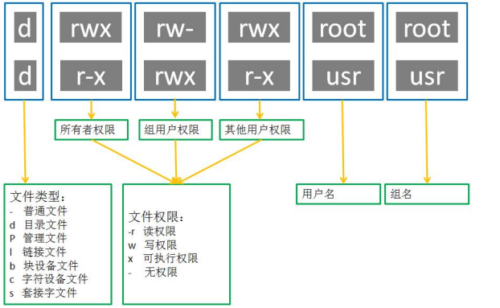

## 1.查看文件信息：ls

| 参数   | 含义                     |
| ---- | ---------------------- |
| -a   | 显示指定目录下所有子目录与文件，包括隐藏文件 |
| -l   | 以列表方式显示文件的详细信息         |
| -h   | 配合 -l 以人性化的方式显示文件大小    |

## 2.清屏：clear

clear作用为清除终端上的显示(类似于DOS的cls清屏功能)，也可使用快捷键：Ctrl + l ( “l” 为小写字母"L" )。

## 3.  切换工作目录： cd

| 命令    | 含义                                       |
| ----- | ---------------------------------------- |
| cd    | 切换到当前用户的主目录(/home/用户目录)，用户登陆的时候，默认的目录就是用户的主目录。 |
| cd .  | 切换到当前目录                                  |
| cd .. | 切换到上级目录                                  |
| cd ~  | 切换到当前用户的主目录(/home/用户目录)                  |
| cd -  | 可进入上次所在的目录                               |

## 4.   显示当前路径：pwd

## 5.   创建目录：mkdir

通过mkdir命令可以创建一个新的目录。参数-p可递归创建目录。

## 6.   删除文件：rm

| 参数   | 含义                       |
| ---- | ------------------------ |
| -f   | 强制删除，忽略不存在的文件，无需提示       |
| -r   | 递归地删除目录下的内容，删除文件夹时必须加此参数 |
| -i   | 以进行交互式方式执行               |

## 7.   拷贝：cp

| 参数   | 含义                                       |
| ---- | ---------------------------------------- |
| -a   | 该选项通常在复制目录时使用，它保留链接、文件属性，并递归地复制目录，简单而言，保持文件原有属性 |
| -f   | 覆盖已经存在的目标文件而不提示                          |
| -i   | 交互式复制，在覆盖目标文件之前将给出提示要求用户确认               |
| -r   | 若给出的源文件是目录文件，则cp将递归复制该目录下的所有子目录和文件，目标文件必须为一个目录名 |
| -v   | 显示拷贝进度                                   |

## 8.   mv：移动、重命名

| 参数   | 含义                                       |
| ---- | ---------------------------------------- |
| -f   | 禁止交互式操作， 如有覆盖也不会给出提示                     |
| -i   | 确认交互方式操作，如果mv操作将导致对已存在的目标文件的覆盖，系统会询问是否重写，要求用户回答以避免误覆盖文件 |
| -v   | 显示移动进度                                   |

## 9.   创建文件: touch

用户可以通过touch来创建一个空的文件

## 10.  输出命令：

```
>
```

Linux允许将命令执行结果重定重定向命向到一个文件，本应显示在终端上的内容保存到指定文件中。 

```
注意： >输出重定向会覆盖原来的内容，>>输出重定向则会追加到文件的尾部。
```

## 11 Yum命令

| 命令                 | 说明                     |
| ------------------ | ---------------------- |
| yum list installed | 显示已经安装的软件包             |
| yum list tomcat    | 查找可以安装的软件包(以 tomcat为例) |
| yum install -y vim | 安装vim软件包               |
| yum remove vim     | 卸载vim软件包               |

```
CentOS操作系统安装和卸载软件有两种方式:
安装命令: yum install -y 安装包
卸载命令: yum remove 安装包
```

## 12.分屏显示：more

查看内容时，在信息过长无法在一屏上显示时，会出现快速滚屏，使得用户无法看清文件的内容，此时可以使用more命令，每次只显示一页，按下空格键可以显示下一页，按下q键退出显示，按下h键可以获取帮助。

## 13.   管道：|

管道：一个命令的输出可以通过管道做为另一个命令的输入。

管道我们可以理解现实生活中的管子，管子的一头塞东西进去，另一头取出来，这里“ | ”的左右分为两端，左端塞东西(写)，右端取东西(读)。

## 14.   建立链接文件：ln

链接文件分为软链接和硬链接。

软链接：软链接不占用磁盘空间，源文件删除则软链接失效。       

硬链接：硬链接只能链接普通文件，不能链接目录。

```
硬链接    
ln 源文件    链接文件  
软链接    
ln -s 源文件 链接文件
```

## 15.   查看或者合并文件内容：cat

```
cat test1.txt test2.txt
```

## 16.   文本搜索：grep

Linux系统中grep命令是一种强大的文本搜索工具，grep允许对文本文件进行模式查找。如果找到匹配模式， grep打印包含模式的所有行。

grep一般格式为：

```
grep [-选项] ‘搜索内容串’文件名
```

在grep命令中输入字符串参数时，最好引号或双引号括起来。

| 选项   | 含义                   |
| ---- | -------------------- |
| -v   | 显示不包含匹配文本的所有行（相当于求反） |
| -n   | 显示匹配行及行号             |
| -i   | 忽略大小写                |

正则表达式

| 正则表达式 | 说明          |
| ----- | ----------- |
| ^     | 以指定字符串开头    |
| &     | 以指定字符串结尾    |
| .     | 匹配一个非换行符的字符 |

grep常用正则表达式：

| 参数           | 含义                                       |
| ------------ | ---------------------------------------- |
| ^a           | 行首,搜寻以m 开头的行；grep-n '^a' 1.txt           |
| ke$          | 行尾,搜寻以ke 结束的行；grep -n 'ke$' 1.txt        |
| [Ss]igna[Ll] | 匹配 [] 里中一系列字符中的一个；搜寻匹配单词signal、signaL、Signal、SignaL的行；grep -n '[Ss]igna[Ll]' 1.txt |
| .            | (点)匹配一个非换行符的字符；匹配 e和 e之间有任意一个字符，可以匹配 eee，eae，eve，但是不匹配 ee，eaae；grep -n 'e.e' 1.txt |

## 17.   查找文件：find

通常用来在特定的目录下搜索符合条件的文件，也可以用来搜索特定用户属主的文件。

格式

```
find 查找路径 -name 文件名称
```

可使用通配符查找

| 通配符  | 说明          |
| ---- | ----------- |
| *    | 代表0个或多个任意字符 |
| ？    | 代表任意一个字符    |

常用用法：

| 命令                   | 含义                    |
| -------------------- | --------------------- |
| find . -name test.sh | 查找当前目录下所有名为test.sh的文件 |
| find . -name '.sh'   | 查找当前目录下所有后缀为.sh的文件    |

## 18.   归档管理：tar

tar使用格式 tar [参数] 打包文件名 文件

```
打包
tar cvf a.tar .txt

解包
tar xvf a.tar -C atar

```

tar命令很特殊，其参数前面可以使用“-”，也可以不使用。

常用参数：

| 参数   | 含义               |
| ---- | ---------------- |
| -c   | 生成档案文件，创建打包文件    |
| -v   | 列出归档解档的详细过程，显示进度 |
| -f   | 指定档案文件名称         |
| -t   | 列出档案中包含的文件       |
| -x   | 解开档案文件           |

## 19.zip和unzip命令

| 命令    | 说明          |
| ----- | ----------- |
| zip   | 压缩成.zip格式文件 |
| unzip | 解压缩.zip格式文件 |

选项

| 选项   | 说明           |
| ---- | ------------ |
| -r   | 压缩目录及目录下所有文件 |
| -d   | 解压缩到指定目录     |

压缩文件尽量使用.gz格式，因为占用空间较少
使用zip命令压缩的文件占用空间比较多, 但比较通用，操作更加简单。	

## 20.权限指令



### 20.1 数字法

格式

```
chmod 数字权限 文件名

chmod -R 数字权限 文件名 //递归的对文件夹及里面的文件进行赋予权限
```

| 权限   | 说明          |
| ---- | ----------- |
| r    | 可读，权限值是4    |
| w    | 可写，权限值是2    |
| x    | 可执行，权限值是1   |
| -    | 无任何权限，权限值是0 |

### 20.2 字母法

| 角色   | 说明              |
| ---- | --------------- |
| u    | user, 表示该文件的所有者 |
| g    | group, 表示用户组    |
| o    | other, 表示其他用户   |
| a    | all, 表示所有用户     |

| 操作符  | 说明   |
| ---- | ---- |
| +    | 增加权限 |
| -    | 撤销权限 |
| =    | 设置权限 |

| 权限   | 说明       |
| ---- | -------- |
| r    | 可读 read  |
| w    | 可写 write |
| x    | 可执行      |
| -    | 无任何权限    |

使用格式

```
chmod 角色+操作符+权限符 文件名
```

## 21.sudo

使用方法

| 命令      | 说明                              |
| ------- | ------------------------------- |
| sudo -s | 切换到root用户，获取管理员权限 (退出当前用户exit)  |
| sudo    | 某个命令的执行需要获取管理员权限可以在执行命令前面加上sudo |

如果只是某次操作需要使用管理员权限建议使用 sudo , 也就是说临时使用管理器权限。
如果大量操作都需要使用管理员权限 sudo –s, 但是操作需谨慎。
如果普通用户要调用sudo, 需要root给用户使用sudo的资格,需修改/etc/sudoers 文件并在最后一
行写入
xiaoming ALL=(ALL) ALL

## 22.whoami

```
whoami     //查看当前用户限

```

## 23.exit

```
exit //退出登录用户
```

如果是切换后的登陆用户，退出则返回上一个登陆账号。
如果是终端界面，退出当前终端。

## 24.who

```
who 查看所有的登录用户
```

## 25.passwd

```
passwd 修改用户密码，不指定用户默认修改当前登录用户密码
```

## 26.which

```
which 查看命令位置
```

## 27.关机和重启

```
shutdown –h now     立刻关机

reboot 				重启
```

sudo 是临时获取管理员权限
sudo -s 是切换到管理员用户，一直使用管理员权限，需要谨慎操作。
exit 是退出当前用户
passwd 默认修改当前用户密码

## 28.创建用户

| 命令      | 说明       |
| ------- | -------- |
| useradd | 创建(添加)用户 |

| 选项   | 说明                           |
| ---- | ---------------------------- |
| -m   | 自动创建用户主目录,主目录的名字就是用户名(用户家目录) |

useradd 命令的使用需要使用管理员权限，前面需要加上 sudo
创建用户如果不指定用户组，默认会自动创建一个同名的用户组
查看用户是否创建成功，可以查看 /etc/passwd 这个文件
查看用户组是否创建成功，可以查看 /etc/group 这个文件

passwd文件中的每项信息说明,以root❌0:0:root:/root:/bin/bash为例:

第一个：用户名
第二个：密码占位符
第三个：uid, 用户id
第四个：gid, 用户所在组id
第五个：用户描述, 可选，
第六个：用户的主目录所在位置
第七个：用户所用 shell 的类型，一般由bash或者sh，默认不设置是sh类型

## 29.id查看

| 命令   | 说明     |
| ---- | ------ |
| id   | 查看用户信息 |

uid=1001(laowang) gid=1001(laowang) 组=1001(laowang)
第一个: uid 表示用户id
第二个: gid 表示用户组id
第三个: 组 表示用户所在的用户组

## 30.设置密码

```
sudo passwd 用户名
```

## 31.切换用户

```
su 切换用户
格式	
su - 用户名

```


创建用户命令格式: sudo useradd -m 用户名 , 默认会创建一个同名的用户组。
查看用户信息使用 id 命令或者 /etc/passwd文件
查看用户组信息使用 /etc/group文件
给用户设置密码使用 sudo passwd 用户名
切换用户使用 su - 用户名	


## 32.远程登录、远程拷贝

| 命令   | 说明   |
| ---- | ---- |
| ssh  | 远程登录 |
| scp  | 远程拷贝 |

ssh格式

```
ssh 用户名@ip地址
```

scp格式

```
远程拷贝文件
scp 本地文件 远程服务器用户名@远程服务器ip地址:指定拷贝到远程服务器的路径
scp 远程服务器用户名@远程服务器ip地址:远程服务器文件 指定拷贝到本地电脑的路径
远程拷贝目标
scp -r 本地目录 远程服务器用户名@远程服务器ip地址:指定拷贝到远程服务器的路径
scp -r 远程服务器用户名@远程服务器ip地址:远程服务器目录 指定拷贝到本地电脑的路径
-r 表示递归拷贝整个目录
```

ssh命令是远程登录主机电脑，相当于直接操作的是远程电脑。
scp命令是可以完成远程拷贝操作，注意:拷贝文件夹需要加-r选项。

## 33.vim

## 33.1 安装:

```
 yum -y install vim
```

## 33.2 命令

```
:w 保存

:q 退出

:wq 保存退出

:x 保存退出

:q! 强制退出
```

## 33.3 其他常用命令

```
yy          复制光标所在行 *
p           粘贴 *
dd          删除/剪切当前行 *
V           按行选中 *
u           撤销
ctr+r       反撤销
>>          往右缩进
<<          往左缩进
:/搜索的内容  搜索指定内容 *
:%s/要替换的内容/替换后的内容/g                          全局替换 *
:开始行数,结束行数s/要替换的内容/替换后的内容 			    局部替换
. 			重复上一次命令操作
G 			回到最后一行
gg 			回到第一行
数字+G 	  回到指定行
shift+6 	回到当前行的行首
shift+4 	回到当前行的行末
ctr+f 		下一屏
ctr+b 		上一屏
:set nu     显示行号
```

## 

## 34 其他指令

```
ifconfig 			查看网卡的配置 （yum install -y net-tools）
ifconfig ethX up 	启用 'ethX' 网卡设备信息
ifconfig ethX down 	禁用 'ethX' 网卡设备信息
ping IP/域名 		   测试从本机到对方网络的连通性
du -h filename 		以适合的方式查看文件占用磁盘空间大小
du -sh dirname 		查看指定文件目录下磁盘占用量
tail -f filename 	动态显示文件内容(默认后10行) （可通过echo重定向演示）
export 				环境变量查看
export env="value" 	添加环境变量
wget url 			下载文件
wget url -O filename 		下载文件并重命名
uname -a 					显示内核版本
cat /etc/redhat-release 	查看centos版本
ps -aux 或 ps -ef 			显示进程状态
kill pid 					停止某进程
kill -9 pid 				强制杀掉进程
history 	显示历史输入的命令
top	动态的显示系统耗费资源最多的进程(P按cpu排序 M按memory排序 Q退出)
poweroff 	关机
reboot 	重启
free 	显示内存使用情况( -k 以KB为单位，-m 以MB为单位，-g以GB为单位)
systemctl status firewalld 	查看防火墙状态
systemctl stop firewalld 	关闭防火墙
netstat -an 	查看端口使用情况
du -h --max-depth=0 *	 查看当前目录文件及文件夹大小
ps -ef | grep 'xxx' |awk '{print $2}'|xargs kill -9 	停止包含xxx相关的进程
```

