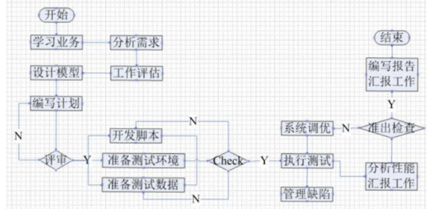

## 1 软件测试

​	在规定（需求）条件下对程序进行操作,从而发现错误,对软件质量进行评估的一个过程.

​	使用人工或自动手段来运行或测试某个系统的过程,其目的在于检验它是否满足规定的需求或是弄清预期
结果和实际结果之间的差别.

## 2 目的

​	是想以最少的人力，物力和时间找出软件中潜在的各种错误与缺陷，通过修正各种错误和缺陷提高软件
质量，回避软件发布后由于潜在的软件缺陷和错误造成的隐患以及带来的商业风险。

## 4 瀑布模型


​	瀑布模型将软件生命周期（开始-结束）划分为制定计划 需求分析 系统设计 程序编写 软件测试和运行维护等六个基本活动，并且规定了它们自上而下 相互衔接的固定次序。

​	在瀑布模型中，软件开发的各项活动严格按照线性方式进行，当前活动的工作结果需要进行验证，如果验证通过，则该结果作为下一项活动的输入，如果不通过则返回修改。

优点：

​	按阶段划分检查点，软件开发的每个阶段都很清晰。

​	在当前阶段完成后，就只需要关注后续阶段。

​	提供了一个模板，让分析 设计 编码 测试在一个模板下共同指导。

缺点:

​	不适应用户需求的变化。

​	阶段之间会产生大量的文档，增加了工作量。

​	开发流程是线性的，用户只能在流程末期的时候才能见到成果，从而增加了开发的风险，需要用户有足够的耐心。

## 5 快速原型模型

​	通过简单的分析，快速的做出一个原型，用户与开发在试用原型的过程中改进近原型 弥补漏洞 适应变化进而提高软件交付质量。

优点:

​	克服瀑布模型的缺点,适应需求的变化,能够开发出更加让用户更满意的需求

缺点:

​	所用的开发技术和工具不一定符合主流发展。

​	快速建立的系统加上频繁的修改会导致产品的质量低下

​	选用模型之前要有展示性的产品原型，在一定程度上影响了开发的创新

## 6 增量模型（迭代模型）

​	整个产品被划分为若干个部分（构件），开发人员逐个构件的去交付产品，这样可以较好地适应变化，客户可以不断地看到所开发的软件，从而降低开发风险。

优点：

​	用户可以及时的了解到软件开发的进展，以组件为单位进行开发降低了 软件开发 的风险。开发顺序更加的灵活。开发人员可以先完成需求稳定的核心组件。

缺点：

​	很容易退化为边做边改模型，从而是软件过程的控制失去整体性

​	要求待开发的软件能给进行增量式的开发,否则会很麻烦

​	

## 7 螺旋模型

​	螺旋模型由风险驱动，强调可选方案和约束条件从而支持软件的重用

（1） 制定计划：确定软件目标，选定实施方案，弄清项目开发的限制条件； 　　
（2） 风险分析：分析评估所选方案，考虑如何识别和消除风险； 　　
（3） 实施工程：实施软件开发和验证； 　　
（4） 客户评估：评价开发工作，提出修正建议，制定下一步计划。

优点:

​	设计灵活可以在项目各个阶段进行变更

​	风险驱动,每个项目上线前都要进行风险分析

缺点:

​	螺旋模型强调风险分析,需要相当丰富的风险评估经验和专业知识

​	如果执行风险分析对项目的利润太影响太大，那么风险分析就毫无意义

## 8 测试模型

​	V模型
​	W(双V)模型
​	H模型（了解）

## 9 v模型

​	单元测试：是模块测试，是在代码层验证代码逻辑是否有问题，也称白盒测试

​	集成测试：是模块间的测试，测试接口是否正确，也就是验证api接口是否正常。

​	系统测试包括：冒烟测试 系统测试 回归测试

​		&冒烟测试：对软件的主干流程进行测试，确认基础功能是否正常，通过则进行后续的测试

​		&系统测试：检测系统的功能 质量 性能是否满足系统的要求包括功能 性能 界面 可靠
性 兼容性等

​		&回归测试：开发修改了代码后重新进行测试，确认修改后的代码没有引入新的错误，或者导致其他代码发生错误

优点:

​	每一个阶段都清晰明了 便于控制开发的每一个过程

​	既包含单元测试又包含系统测试验收测试：是确保软件的实现能否满足用户的需求或合同的要求 

缺点:

​	测试介入的较晚,对于前期的一些缺陷无从发现和修改

​	测试和开发串行

## 10 功能 界面 易用性 安全性 兼容性 性能测试中测试的内容

​	

​	功能测试：验证软件功能是否正常 功能是否完整 功能是否满足用户需求等。

​	界面测试：主要包括界面布局是否合理 操作是否方便 响应是否及时 界面是否美观 是否有错别字等

​	易用性测试：包括操作流程是否合理 操是否简单等

​	安全性测试：测试软件或应用程序是否存在安全漏洞，包括网络安全 数据安全等，检查是否存在潜在的安全隐患，是否有数据泄露 数据损坏等情况。

​	兼容性测试：测试软件或应用程序是否能够在不同平台 不同操作系统 不同浏览器等环境下正常工作，包括硬件兼容性和软件兼容性。

​	性能测试：包括响应时间 负载能力 并发性能 稳定性等。

## 11 W模型

​	W模型是V模型的发展，强调的是测试伴随着整个软件开发周期，而且测试的对象不仅仅是程序，需求 
功能和设计同样要测试。测试与开发是同步进行的，从而有利于尽早地发现问题。

优点：	

​	测试伴随软件的整个生命周期,例如,在需求分析结束后就可以进行需求分析测试 

​	测试于开发是并行独立进行

缺点：

​	对需求和测试技术要求高

## 12 H模型

​	H模型中, 软件测试过程活动完全独立,贯穿于整个产品的周期,与其他流程并发地进行,某个测试点准备就
绪时,就可以从测试准备阶段进行到测试执行阶段。

优点:

​	开发的H模型揭示了软件测试除测试执行外，还有很多工作；

​	软件测试完全独立，贯穿整个生命周期，且与其他流程并发进行；

​	软件测试活动可以尽早准备 尽早执行，具有很强的灵活性；

缺点:

​	管理型要求高：由于模型很灵活，必须要定义清晰的规则和管理制度，否则测试过程将非常难以管
理和控制；

​	技能要求高：H模型要求能够很好的定义每个迭代的规模，不能太大也不能太小；

​	测试就绪点分析困难：测试很多时候，你并不知道测试准备到什么时候是合适的，就绪点在哪里，
就绪点的标准是什么，这就对后续的测试执行的启动带来很大困难；

总结：

​	V模型: 强调了在整个软件项目开发中需要经历的若干个测试级别，并与每一个开发级别对应；忽略了测
试的对象不应该仅仅包括程序，没有明确指出对需求 设计的测试

​	W模型: 补充了V模型中忽略的内容，强调了测试计划等工作的先行和对系统需求和系统设计的测试；与
V模型相同，没有对软件测试的流程进行说明

​	H模型: 强调测试是独立的，只要测试准备完成，就可以执行测试

## 13 软件测试的分类

### 	13.1 按阶段划分

单元测试

​	单元测试是对软件组成单元进行测试。**其目的是检验软件基本组成单位的正确性。**测试的对象是软件设
计的最小单位：模块。

```
	测试阶段：编码后
	测试对象：最小模块(源代码:逻辑语句->方法->文件)
	测试人员：白盒测试工程师或开发工程师,一般情况都是由开发工程师自行测试(代码走查,评审，代码扫描)
	测试依据：代码和注释+详细设计文档
	测试方法：白盒测试(代码相关)强度由低到高:语句覆盖 判定覆盖 条件覆盖 判定条件覆盖 条件组合覆盖 路径覆盖

	测试内容：模块接口测试 局部数据结构测试 路径测试 错误处理测试 边界测试
```

集成测试

​	集成测试也称联合测试 组装测试，将程序模块采用适当的集成策略组装起来，对系统的接口及集成后
的功能进行正确性检测的测试工作。**主要目的是检查软件单位之间的接口是否正确。**

```
测试阶段：一般单元测试之后进行
测试对象：模块间的接口(模块间的交互)
测试人员：白盒测试工程师或开发工程师,测试工程师
测试依据：开发接口文档
测试方法：黑盒测试与白盒测试相结合(灰盒测试)
测试内容：模块之间数据传输 模块之间功能冲突 模块组装功能正确性 全局数据结构 单模块缺陷对系统的影响
```

 单元测试是一个模块内部的测试，集成测试是在模块之间进行测试（至少两个）

系统测试

​	将软件系统看成是一个系统的测试。**包括对功能 性能以及软件所运行的软硬件环境进行测试**。时间大
部分在系统测试执行阶段,包**括回归测试和冒烟测试**

```
测试阶段：集成测试通过之后
测试对象：整个系统（软 硬件）
测试人员：黑盒测试工程师
测试依据：需求规格说明文档
测试方法：黑盒测试
测试内容：功能 非功能质量特性（界面 可靠性 网络 易用性 性能 兼容性 安全性等）其它方面 其他维度
```

（1）系统测试是从完整的角度，广面去看待问题，不再看模块 （2）虽然系统测试包括冒烟测试和回归测试，但三者之间是有严格的先后顺序的，即：先冒烟 再系统 后回归

### 13.2 按是否覆盖源码划分

黑盒测试

​	黑盒测试也称功能测试，测试中把被测的软件当成一个黑盒子，不关心盒子的内部结构是什么，只关心
软件的输入数据与输出数据。黑盒测试又分为功能测试和非功能测试

功能测试

```
业务测试 ：是指测试人员将系统的整个模块串接起来运行 模拟真实用户实际的工作流程。满足用户需求定义的功能来进行测试的过程
易用性 （Useability）是交互的适应性 功能性和有效性的集中体现。又叫用户体验测试。
界面测试 （简称UI测试)，测试用户界面的功能模块的布局是否合理 整体风格是否一致 各个控件的放置位置是否符合客户使用习惯，此外还要测试界面操作便捷性 导航简单易懂性，页面元素的可用性，界面中文字是否正确，命名是否统一，页面是否美观，文字 图片组合是否完美等。
安装测试 :是指测试程序的安装 卸载。最典型的就是APP的安装 卸载。
兼容性测试 :主要是指软件之间能否很好的运作，会不会有影响 软件和硬件之间能否发挥很
好的效率工作，会不会影响导致系统的崩溃。例如最常见的是浏览器的兼容性测试,不同浏览器在css js解析的不同会造成页面的不同.
```

性能测试

检查系统是否满足需求规格说明书中规定的性能。通常表现在以下几个方面	

```
对资源利用（如内存 处理机周期等）进行的精确度量
对执行间隔
日志事件（如中断，报错）
响应时间
吞吐量（TPS）
辅助存储区（例如缓冲区 工作区的大小等）
处理精度等进行的监测
```


白盒测试

​	白盒测试又称结构测试 透明盒测试 逻辑驱动测试或基于代码的测试。白盒指的打开盒子，去研究里
面的源代码和程序结果。

灰盒测试

​	灰盒测试，是介于白盒测试与黑盒测试之间的一种测试，灰盒测试多用于集成测试阶段，不仅关注输
出 输入的正确性，同时也关注程序内部的情况。

```
灰盒测试:功能 + 接口
```

### 13.3 按是否执行程序划分

静态测试

​	静态方法是指不运行被测程序本身，仅通过分析或检查源程序的语法 结构 过程 接口等来检查程序
的正确性。对需求规格说明书 软件设计说明书 源程序做结构分析 流程图分析 符号执行来找错。

```
检查项：代码风格和规则审核；程序设计和结构的审核；业务逻辑的审核；走查 审查与技术复审手册。

静态质量：度量所依据的标准是ISO9126。在该标准中，软件的质量用以下几个方面来衡量，即功能性 可靠性 可用性 有效性 可维护性 可移植性。
```

动态测试

​	动态测试方法是指通过运行被测程序，检查运行结果与预期结果的差异，并分析运行效率 正确性和健
壮性等性能。这种方法由三部分组成：构造测试用例 执行程序 分析程序的输出结果。

```
(1）动态测试有三部分组成：构造测试用例 执行程序 分析程序的输出结果。 (2）大多数软件测
试都属于动态测试。
```

### 13.4 按是否自动化分

手工测试

​	手工测试就是由人去一个一个的输入用例，然后观察结果，和机器测试相对应，属于比较原始但是必须
的一个步骤。

```
优点：自动化无法替代探索性测试 发散思维类无既定结果的测试。
缺点：执行效率慢，量大易错。
```

自动化测试

​	就是在预设条件下运行系统或应用程序，评估运行结果，预先条件应包括正常条件和异常条件。简单说
自动化测试是把以人为驱动的测试行为转化为机器执行的一种过程。

```
自动化测试有：测试自动化 性能测试自动化 安全测试自动化。（一般情况下，我们说的自动化是指功能测试的自动化）
自动化测试按照测试对象来分，还可以分为接口测试 UI测试等
```

```
自动化实施的步骤:
(1) 完成功能测试，版本基本稳定
(2) 根据项目特性，选择适合项目的自动化工具，并搭建环境
(3) 提取手工测试的测试用例转换为自动化测试的用例
(4) 通过工具 代码实现自动化的构造输入 自动检测输出结果是否符合预期
(5) 生成自动测试报告
(6) 持续改进 脚本优化	
```

### 13.5 其他

#### 13.5.1 冒烟测试

​	该术语来自硬件，指对一个硬件或一组硬件进行更改或修复后，直接给设备加电。如果没有冒烟，则该组件就通过了测试。

​	冒烟测试的目的是确认软件基本功能正常，可以进行后续正式的测试工作。冒烟测试的执行者是版本编译人。 冒烟测试一般在开发人员开发完毕后送给测试人员来进行测试时，测试人员会先进行冒烟测试，保证基本功能正常，不阻碍后续测试。提升提测质量。

#### 13.5.2 回归测试

​	自动回归测试将大幅度降低系统测试 维护升级等阶段的成本.

​	在整个软件测试过程中占有很大的工作比重，软件开发的各个阶段都会进行多次回归测试。随着系统的
庞大，回归测试的成本越来越大，通过正确的回归测试策略来改进回归测试的效率和有效性是很有意义
的。	

#### 13.5.3  随机测试

​	随机测试主要是根据测试者的经验对软件进行功能和性能抽查。

​	根据测试说明书执行用例测试的重要补充手段，是保证测试覆盖完整性的有效方式和过程。

​	随机测试主要是对被测软件的一些重要功能进行复测，也包括测试那些当前的测试用例(TestCase)没有
覆盖到的部分。

#### 13.5.4 验收测试

·	验收测试是部署软件之前的最后一个测试操作, 也称为交付测试.验收测试的目的是确保软件准备就绪，
按照项目合同 任务书 双方约定的验收依据文档，向软件购买都展示该软件系统满足原始需求。

```
测试阶段：系统测试通过之后
测试对象：整个系统（包括软硬件）。
测试人员：主要是最终用户或者需求方。
测试依据：用户需求 验收标准
测试方法：黑盒测试
测试内容：同系统测试(功能...各类文档等)
```


验收测试按照实施的组织不同分为:α测试和β测试

##### α测试

```
α测试是由一个用户在开发环境下进行的测试，也可以是公司内部的用户在模拟实际操作环境下进行的测试。

α测试的目的是评价软件产品的FLURPS(即功能 局域化 可使用性 可靠性 性能和支持)。大型通用软件，在正式发布前，通常需要执行Alpha和Beta测试。α测试不能由程序员或测试员完成。
```


##### β测试

Beta测试是一种验收测试。Beta测试由软件的最终用户们在一个或多个客房场所进行。

```
α测试与β测试的区别：

测试的场所不同：Alpha测试是指把用户请到开发方的场所来测试,beta测试是指在一个或多个用户
的场所进行的测试。

Alpha测试的环境是受开发方控制的,用户的数量相对比较少,时间比较集中。beta测试的环境是不受
开发方控制的,用户数量相对比较多,时间不集中。

```

## 14 测试基本原则及流程

1 一切测试要追溯到用户的需求

2 应该把“尽早测试和不断测试”作为测试人员的座右铭

3 pareto原则(二八原则):80%的错误,发生在20%的模块中

4  穷举测试是不可能的

5  第三方测试会更客观

6 测试用例是设计出来的, 不是写出来的

7 不可将测试用例置之度外，排除随意性

8 测试贯穿于整个生命周期

9  对发现错误较多的程序段，应进行更深入的测试。

10 要妥善的保存一切文档,便于后期进行复用

## 15  软件测试的基本流程



需求分析阶段：

​	阅读需求 理解需求，分析需求点，参与需求评审会议。

测试计划阶段：

​	主要任务就是编写测试计划，参考软件需求规格说明书，项目总体计划，内容包括测试范围，进度安排，人力物力分配，整体测试策略的制定,风险评估与规避措施，参与测试计划的评审工作。

测试设计阶段：

​	编写测试用例，参考需求分析 概要设计 详细设计，不明确的与开发 产品经理沟通。用例完成后进行评审

测试执行阶段：

​	搭建测试环境准备数据，执行冒烟测试（预测试）然后进入正式测试（系统测试 回归测试 交叉测试），遇到问题提交bug(缺陷报告)到缺陷管理平台，并对bug进行跟踪，直到被测试软件达到测试需求要求，没重大bug，测试结束。

评估阶段：

​	出测试报告，对整个测试的过程和版本质量做一个详细的评估。

## 16 需求评审会议

​	1 消除歧义。有些需求可能会产生二义性

​	2 提出隐性需求。提出有些需求没有提出但要做好软件必须要有的需求

​	3 限制要求

​	4 分清任务的优先级。对任务的主次进行划分，明确每个任务的重要程度

​	5 明确项目周期。对项目的周期有一个大概了解方便对自身任务进度的安排

​	6 明确分工（了解任务的人员分配）

## 17 与开发起冲突，出现问题开发不解决

​	出现问题首先确认问题是否真的是一个问题，出现问题时先确认bug是否紧急，若是紧急bug就让开发做紧急处理，若没那么紧急则可以缓后，若是细微到可以忽视的问题则可先略过。

​	如果是向开发询问不修改的原因

​	如果开发坚持不修改，则向开发复现问题

​	如果依旧坚持则向产品经理或上级领导确认是否需要修改